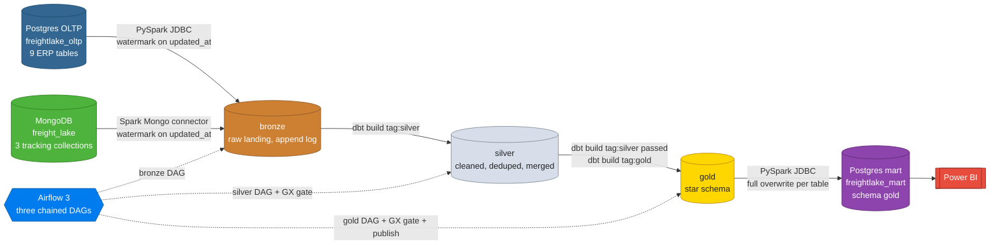
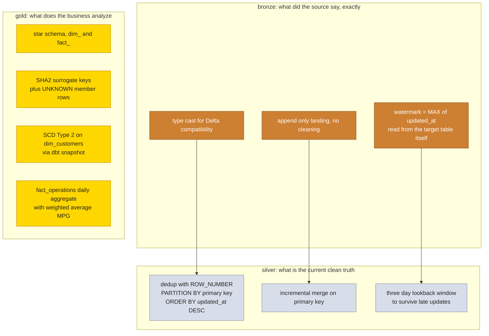
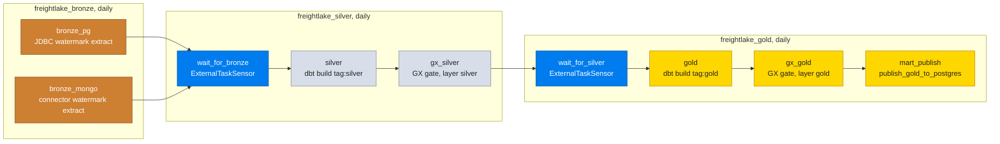
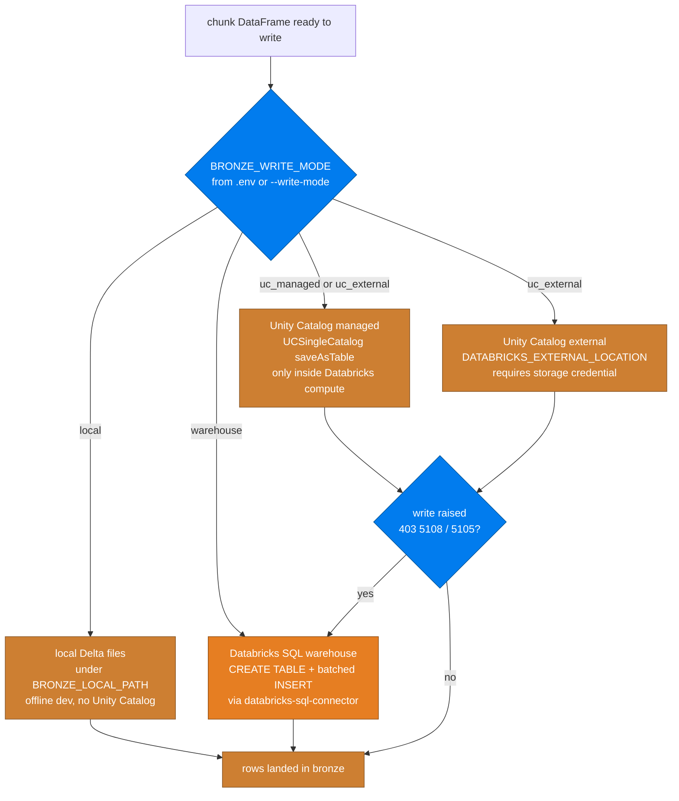

# FreightLake Architecture

Logistics medallion lakehouse: Postgres OLTP and MongoDB as simulated source
systems, a bronze/silver/gold medallion on Databricks Delta, a Postgres
serving mart for BI, orchestrated by Airflow and quality gated by dbt tests
plus Great Expectations. This document explains the four views of the system
and the design decision behind each layer. Step by step pipeline detail lives
in `docs/PIPELINE.md`; the column level reference lives in
`docs/DATA_DICTIONARY.md`.

## 1. System context

## 2. Medallion layers

Each layer answers one question and hands a strictly better dataset to the
next. The colors below match the layer colors used across all diagrams.

### Bronze design decisions

- **Watermark without a state table.** The watermark for each table is
  `MAX(updated_at)` read straight out of the target Delta table. A separate
  `etl_watermark` table would be one more thing to keep in sync and one more
  thing to lose; the target table already knows what it captured.
- **Append log, not upsert.** Bronze keeps every version of a row that the
  source ever exposed. Dedup and merge happen once, in silver, where the
  merge key is the primary key. This keeps reruns cheap and makes the raw
  layer replayable.
- **Inclusive versus exclusive bounds.** A full load includes its lower
  bound; an incremental run excludes it, because the watermark value was
  already captured inclusively last run. `build_windows()` in
  `src/jobs/pg_extract_incremental.py` encodes this; the tied timestamp edge
  case (every row sharing one `updated_at` on bulk seeded data) is handled
  and tested.
- **Chunking.** The `[start, end]` range is split into seven day windows,
  each read and written on its own, with four parallel JDBC connections per
  window and a fetch size of 50000. A failing chunk can be rerun without
  touching earlier ones.

### Silver design decisions

- **Incremental merge with a safety lookback.** Every silver model selects
  source rows at or newer than `MAX(updated_at)` from itself minus three
  days, then merges on the primary key. The lookback absorbs late arriving
  updates and clock skew; the merge makes overlap harmless.
- **Dedup before merge.** `ROW_NUMBER() OVER (PARTITION BY <primary key>
  ORDER BY updated_at DESC)` keeps only the newest version, so the merge
  never has to resolve conflicts.
- **Schema evolution.** `on_schema_change='sync_all_columns'` so a new
  source column flows through without a manual migration.

### Gold design decisions

- **Star schema only.** Seven dimensions, seven facts, one daily aggregate
  (`fact_operations`). No gold table outside the `dim_`/`fact_` shape.
- **Surrogate keys with UNKNOWN members.** Dimension keys are `SHA2` hashes.
  Every dimension carries an `UNKNOWN` row so fact foreign keys stay not null
  when a natural key has no match, with `is_unmatched_*` flags preserving the
  signal that something did not match.
- **SCD Type 2 on customers only.** `dbt/snapshots/customers_snapshot.sql`
  captures history with the timestamp strategy; `dim_customers` exposes
  `effective_from`, `effective_to`, `is_current` and a surrogate key that
  includes the validity start.
- **Weighted averages, never averages of ratios.** `fact_operations`
  computes daily MPG as total miles over total gallons, not `AVG(average_mpg)`,
  which would bias the daily figure toward short trips.

### Publish design decisions

- **Full overwrite per table.** Gold models are materialized as tables, so
  the mart publisher truncates and reinserts each table through Spark JDBC
  with a batch size of 10000 and a repartition to 4. BI tools query the
  mart, never Databricks directly.
- **Mart indexes.** `sql/serving_mart/indexes.sql` creates foreign key and
  date key indexes on every fact for the BI access patterns.

## 3. Orchestration

Three Airflow DAGs, chained with `ExternalTaskSensor`. Bronze extracts both
sources in parallel; silver and gold each run their dbt build, then a Great
Expectations gate that fails the DAG on error severity. Publish runs only
after the gold gate passes.

All three DAGs share the same `@daily` schedule and start date, so sensor
logical dates line up without an execution delta. Task commands run through
`uv run` so they use the project virtual environment inside the Airflow
container, where the scheduler's own interpreter does not carry pyspark or
dbt.

## 4. Bronze write paths

Databricks blocks managed table creation and staging credentials from
outside its own compute (HTTP 403, ErrorCode 5108 and 5105). The write
strategy is therefore configurable per run, with a documented default that
works from a laptop.

The Postgres and Mongo extraction jobs share this routing, as does the gold
to mart publisher in its local variant. `warehouse` is the default because
it is the only path verified to work from outside Databricks compute.

## 5. Quality gates

Two independent gate systems cover the same contracts:

- **dbt tests** run as part of `dbt build` inside the silver and gold DAGs.
  Generic tests under `dbt/tests/generic/` (no empty strings, no white
  spaces, no future dates, no orphan rows, accepted range, matches regex)
  plus standard not null, unique, relationships and accepted values tests.
- **Great Expectations suites** in `gx/expectations/` mirror the dbt tests
  and run against the published mart tables in Postgres, so the same rules
  validate the lakehouse and the serving layer.

Severity semantics are identical in both: `error` fails the DAG and blocks
promotion, `warn` documents a known issue (see `docs/DATA_QUALITY.md` for
the current list). The DAG tasks have no demo fallback on purpose: an
unreachable validation database is a failed gate, not a skipped one.

## 6. Non goals

Deliberately out of scope, documented so nobody fills them in as gaps: no
streaming (Kafka, Flink, Spark Structured Streaming), no row level
security, no realtime serving layer, no multi region deployment. The
project demonstrates batch medallion patterns on a laptop sized stack.
