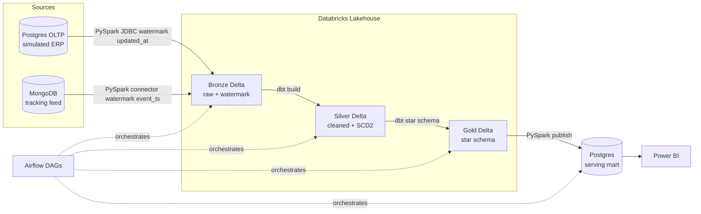
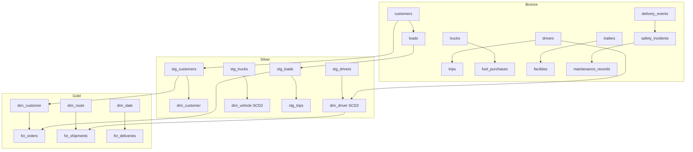
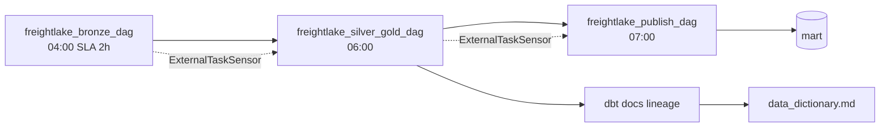
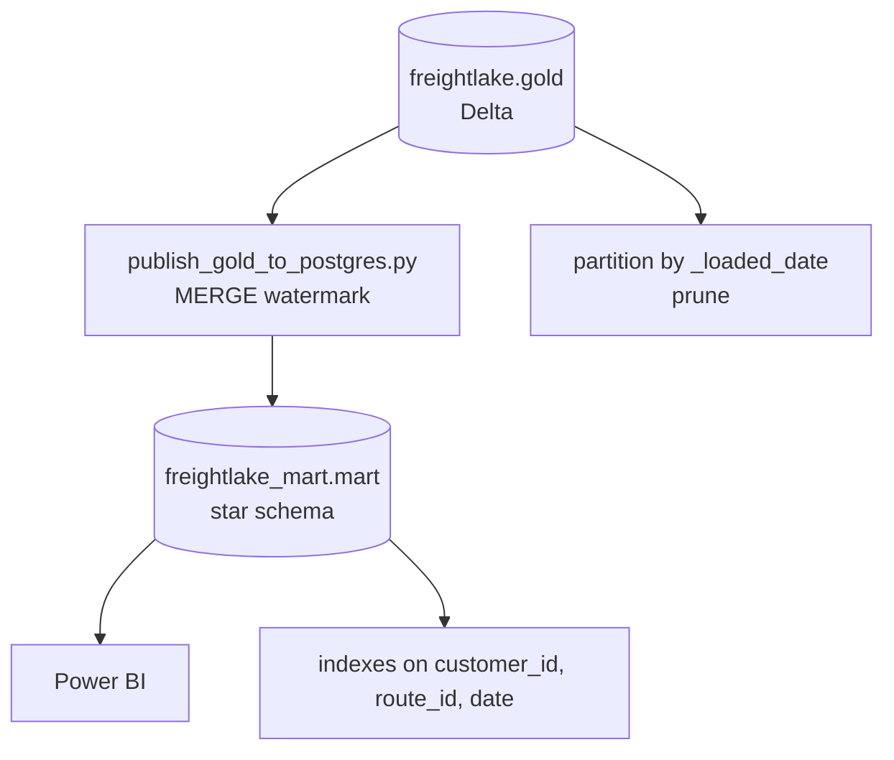

# FreightLake Architecture

Portfolio grade logistics lakehouse covering every term in the 40 term data engineering checklist `docs/PROJECT_PLAN.md:394`.

## High level

Two sources are deliberate. Real logistics has a relational system of record for orders and master data plus a high volume loosely structured event stream for tracking. Modeling that split is more convincing than a single flat CSV import.

## Layers

### Bronze — raw landing
Jobs `spark_jobs/bronze/extract_postgres_oltp.py` and `extract_mongo_tracking.py` read via watermark table `freightlake.bronze.etl_watermark` and write with `MERGE INTO` upserts keyed on business or event id. Idempotency by construction, partitioned by ingestion date, minimal transform of type casting plus `_loaded_at`. See `sql/databricks/bronze_tables.sql`.

Postgres tables: `customers`, `drivers`, `trucks`, `trailers`, `facilities`, `routes`, `loads`, `trips`, `fuel_purchases`.
Mongo collections: `delivery_events`, `safety_incidents`, `maintenance_records`.

### Silver — cleaned and conformed
dbt models under `dbt/models/silver/` deduplicate and standardize. `dim_driver` and `dim_vehicle` are SCD Type 2 via `dbt snapshot` with `valid_from`, `valid_to`, `is_current`. Tests cover not null, unique, relationships. Great Expectations runs alongside for statistical checks. Schema evolution handled by Delta column mapping.

### Gold — star schema and semantic layer
Facts `fct_orders`, `fct_shipments`, `fct_deliveries` plus dims `dim_customer`, `dim_driver`, `dim_vehicle`, `dim_warehouse`, `dim_route`, `dim_date`. Metrics `on time delivery rate`, `average delivery time`, `revenue per route` defined once in `dbt/models/gold/metrics.yml`. See `sql/databricks/schemas.sql` for catalog.

### Publish — gold to mart
`spark_jobs/publish/publish_gold_to_postgres.py` reads gold Delta and upserts into Postgres mart `sql/serving_mart/` for fast BI queries without hitting Databricks on every dashboard click.

## Orchestration

Three DAGs chained by `ExternalTaskSensor` `airflow/dags/`:
1. `freightlake_bronze_dag` — both extractions parallel, daily, SLA 6 AM
2. `freightlake_silver_gold_dag` — `dbt build`, fails on data quality gate
3. `freightlake_publish_dag` — publish job downstream of silver gold

Source freshness checks cover both raw sources.

## Data quality

dbt tests for structural checks plus Great Expectations suite `great_expectations/` for value ranges, row count minimums, regex on tracking numbers. 95 percent pass gate before promoting silver to gold.

## Choices documented

Delta Lake over Iceberg due to native Databricks integration and `MERGE INTO` maturity. ELT over ETL because transform lives inside lakehouse via dbt. LocalExecutor for Airflow keeps compose simple. Databricks Community Edition is sufficient, Unity Catalog features degrade gracefully to hive metastore.

## Medallion detail

## Orchestration and lineage

## Serving and performance

## Repo layout

See `docs/PROJECT_PLAN.md:198`. Build order follows phases `docs/PROJECT_PLAN.md:374`.
