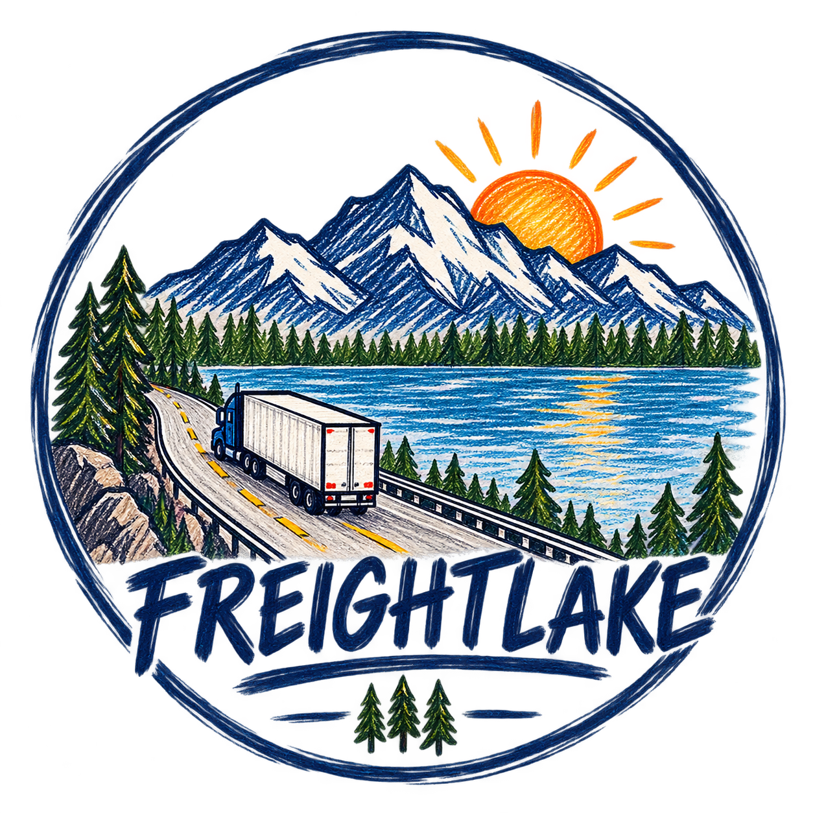
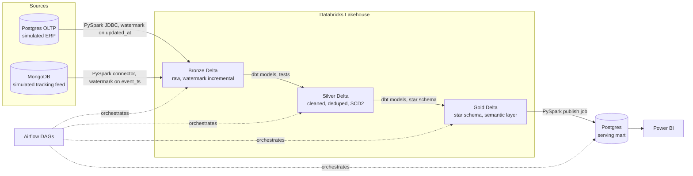
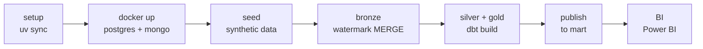

<p align="center">
  
</p>

<h1 align="center">FreightLake</h1>

<p align="center">
  <em>A logistics data platform that ingests orders from a simulated ERP system and shipment tracking events from a simulated IoT feed, refines them through a medallion architecture on Databricks, and publishes a governed star schema to Postgres for BI consumption, all orchestrated end to end by Airflow.</em>
</p>

<p align="center">
  <a href="https://github.com/Nitinx12/Logistics-Medallion-Pipeline/actions/workflows/python-ci.yml"></a>
  <a href="https://github.com/Nitinx12/Logistics-Medallion-Pipeline/actions/workflows/sql-lint.yml"></a>
  <a href="https://github.com/Nitinx12/Logistics-Medallion-Pipeline/actions/workflows/dbt-ci.yml"></a>
  <a href="https://github.com/Nitinx12/Logistics-Medallion-Pipeline/actions/workflows/docker-build.yml"></a>
  <a href="LICENSE"></a>
</p>

<p align="center">
  
  
  
  
  
  
  
  
  
</p>

## Architecture





> **Why two sources?** Nearly every real logistics platform has this exact split, a relational system of record plus a high volume loosely structured event stream. Modeling that split is more convincing in an interview than a single flat CSV import.

## Quick start

Five minutes from clone to first pipeline, per the goal in `docs/PROJECT_PLAN.md`.

```bash
git clone https://github.com/Nitinx12/Logistics-Medallion-Pipeline.git
cd Logistics-Medallion-Pipeline
cp .env.example .env   # fill Databricks values if you have them; local run works without
uv sync
python main.py          # one command: setup -> docker -> seed -> bronze -> silver/gold -> publish
```

With Postgres and Mongo already running:

```bash
python main.py --skip-docker
```

Preview the plan without executing:

```bash
python main.py --dry-run
uv run python main.py --dry-run
```

Make equivalents (same orchestration, no second path):

```bash
make pipeline          # same as python main.py
make setup             # uv sync + pre commit hooks
make docker-up         # Postgres, Mongo, Airflow at localhost:8090
make lint              # ruff + sqlfluff + mypy
make test              # pytest + dbt test
make ci                # lint + test
```

PowerShell (paired per `docs/PROJECT_PLAN.md`):

```powershell
Copy-Item .env.example .env
uv sync
python main.py --skip-docker
# or
.\scripts\powershell\setup.ps1
.\scripts\powershell\seed_data.ps1
.\scripts\powershell\run_pipeline.ps1
```

Databricks note: Community Edition is enough for the lakehouse. If `DATABRICKS_TOKEN` lacks `sql` scope you will see `sql scope` in `make dbt-build`; run `sql/databricks/schemas.sql` in the warehouse UI or add the scope. Local `delta/` + `freightlake_mart` still run.

## What is in each layer

**Bronze** lands raw with watermark incremental reads. Two PySpark jobs pull only rows where `updated_at` or `event_ts` is past the last high water mark stored in `etl_watermark`, then upsert with `MERGE INTO` so reruns stay idempotent. Files are written as partitioned Parquet under Delta with an added `_loaded_at`.

**Silver** cleans and conforms. Deduping, trimming, and type casting are applied, then `dim_driver` and `dim_vehicle` are kept as Slowly Changing Dimensions Type 2 via `dbt snapshot` with `valid_from`, `valid_to`, `is_current`. Every model has `not_null`, `unique`, and `relationships` tests, with a Great Expectations suite as a second quality gate. Delta schema merge lets new fields in `tracking_events` arrive without breaking the load.

**Gold** exposes a star. Facts `fct_orders`, `fct_shipments`, `fct_deliveries` join to dims `dim_customer`, `dim_driver`, `dim_vehicle`, `dim_warehouse`, `dim_route`, `dim_date`. A small `metrics.yml` defines shared measures such as on time delivery rate and revenue per route so dashboards do not recalculate them differently.

**Publish** keeps BI fast. A final PySpark job reads Gold Delta and upserts into `freightlake_mart` Postgres. Dashboards hit Postgres, not Databricks, for low latency.

## Docs

- [ARCHITECTURE.md](ARCHITECTURE.md) — four Mermaid diagrams and per-layer design decisions
- [docs/PROJECT_PLAN.md](docs/PROJECT_PLAN.md) — full roadmap, tech stack, and build order
- [docs/data_dictionary.md](docs/data_dictionary.md) — every table and column, generated from `dbt docs generate`
- [CHANGELOG.md](CHANGELOG.md) — what is new in each version
- [CONTRIBUTING.md](CONTRIBUTING.md) — how to set up, branch, and test before a PR
- `dbt docs` lineage — run `make dbt-docs` or `uv run dbt docs generate --static` and open `target/index.html`

README stays short by design — detail lives in the docs above.

## License

MIT © 2026 Nitin — see [LICENSE](LICENSE). Changes are tracked in [CHANGELOG.md](CHANGELOG.md).
