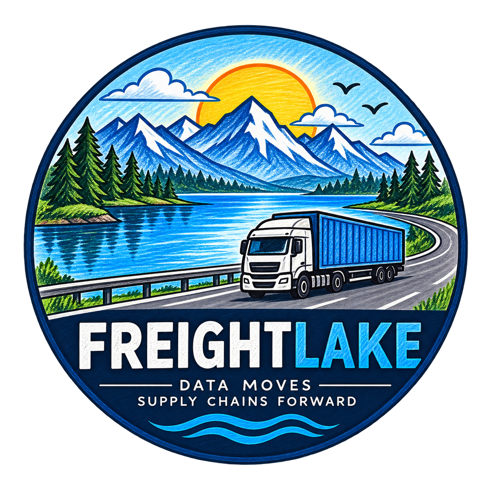
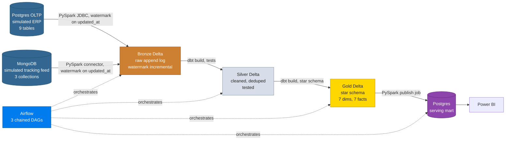
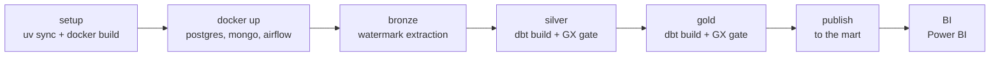

<p align="center">
  
</p>

<h1 align="center">FreightLake</h1>

<p align="center">
  <em>A logistics data platform that ingests freight operations data from a simulated Postgres ERP and tracking events from a simulated MongoDB feed, refines them through a medallion architecture on Databricks Delta Lake, and publishes a star schema to a Postgres serving mart for BI, orchestrated end to end by Airflow.</em>
</p>

<p align="center">
  
  
  
  
  
  
  
  
  
  
</p>

<p align="center">
  <a href="https://github.com/Nitinx12/Logistics-Medallion-Pipeline/actions/workflows/ci.yml"></a>
  <a href="https://github.com/Nitinx12/Logistics-Medallion-Pipeline/actions/workflows/lint.yml"></a>
  <a href="https://github.com/Nitinx12/Logistics-Medallion-Pipeline/actions/workflows/unit-tests.yml"></a>
  <a href="https://github.com/Nitinx12/Logistics-Medallion-Pipeline/actions/workflows/sql-and-types.yml"></a>
  <a href="https://github.com/Nitinx12/Logistics-Medallion-Pipeline/actions/workflows/security.yml"></a>
</p>

---

## Architecture





> **Why two sources?** Nearly every real logistics platform has this exact split, a relational system of record plus a high volume loosely structured event stream. Modeling that split is more convincing in an interview than a single flat CSV import.

---

## Quick Start

```bash
git clone https://github.com/Nitinx12/Logistics-Medallion-Pipeline.git
cd Logistics-Medallion-Pipeline
cp .env.example .env      # then fill in your Databricks credentials
uv sync
make pipeline             # docker, bronze, silver, gold, publish
```

With Postgres, MongoDB and Airflow already running:

```bash
make pipeline ARGS="--skip-docker"
```

Preview the plan without executing:

```bash
uv run python main.py --dry-run
```

Run a single stage:

```bash
uv run python main.py --stage gold
```

PowerShell (Windows):

```powershell
Copy-Item .env.example .env
uv sync
.\scripts\powershell\local_runner.ps1
# or per layer, paired with the bash scripts:
.\scripts\powershell\run_bronze.ps1
.\scripts\powershell\run_silver.ps1
.\scripts\powershell\run_gold.ps1
.\scripts\powershell\publish_mart.ps1
```

Every bash script under `scripts/bash/` has, or is getting, a matching
PowerShell script under `scripts/powershell/` with identical behavior and
summary output.

---

## Make Targets

| Target | What it does |
|---|---|
| `make setup` | `uv sync` + build the Docker image |
| `make docker-up` / `make docker-down` | Start / stop Postgres, MongoDB, Airflow (UI on port 8080) |
| `make health` | One shot health check of every service |
| `make hooks` | Install git hooks from `.githooks` |
| `make bronze` | Run both PySpark extraction jobs |
| `make silver` | `dbt build` silver models + tests |
| `make gold` | `dbt build` gold models + tests |
| `make gx` | Great Expectations quality gate against Postgres |
| `make publish` | Publish gold to the Postgres serving mart |
| `make pipeline` | Full run: docker, bronze, silver, gold, publish |
| `make dbt-docs` | Generate the dbt docs site |
| `make lint` | `ruff check` + `ruff format --check` + `sqlfluff lint` |
| `make lint-fix` | Auto fix ruff issues |
| `make fmt` / `make fmt-check` | Format or check formatting with `ruff format` |
| `make test` | `pytest` |
| `make test-cov` | `pytest` with coverage |
| `make verify` | Fast local verify: lint + test + GX demo, same as CI |
| `make ci` | Alias for `verify` |
| `make polish` | `lint-fix` + `fmt` across the repo |
| `make clean` | Stop the stack, remove build artifacts |

---

## What Lives in Each Layer

**Bronze** lands raw with watermark incremental reads. Two jobs pull only rows where `updated_at` exceeds `MAX(updated_at)` already in the target Delta table, computed per table from the target itself, so there is no separate watermark state to drift. Reads are chunked into 7 day windows with 4 parallel JDBC partitions. Four write modes: `warehouse` (default, via SQL warehouse), `local` (Delta under `./spark-warehouse`, no Databricks needed), `uc_managed`, `uc_external`, with automatic fallback on Unity Catalog 403 errors.

**Silver** cleans and conforms. String columns are trimmed (the OLTP source has padded spaces), types are cast, and duplicates are collapsed with `ROW_NUMBER()` over the primary key before an incremental `merge`. Twelve models, each with full `not_null` / `unique` / `accepted_values` / `relationships` coverage in `_silver.yml`, including warn severity tests that document known upstream gaps.

**Gold** exposes a star schema. Seven dimensions (`dim_customers`, `dim_drivers`, `dim_facilities`, `dim_routes`, `dim_trucks`, `dim_trailers`, `dim_date`) and seven facts (`fact_loads`, `fact_trips`, `fact_fuel_purchases`, `fact_delivery_events`, `fact_maintenance_records`, `fact_safety_incidents`, `fact_operations`). Surrogate keys are SHA2 hashes, every dimension carries an UNKNOWN member row so fact foreign keys stay not null, and `dim_customers` is SCD Type 2 via a dbt snapshot (`effective_from` / `effective_to` / `is_current`). `fact_operations` is the daily aggregate with the weighted average MPG (total miles over total gallons, not the average of per trip ratios).

**Publish** keeps BI fast. A PySpark JDBC job overwrites the gold tables into the `gold` schema of the `freightlake_mart` Postgres database. BI tools connect to Postgres, not Databricks, for low latency.

---

## Workflows

Granular GitHub Actions workflows run on every pull request to `main`. Each can also be triggered manually.

| Workflow | File | What it does |
|---|---|---|
| CI | `.github/workflows/ci.yml` | Full gate: ruff, format, sqlfluff, mypy, pytest, GX demo, dbt parse and docs, secrets scan |
| Lint | `.github/workflows/lint.yml` | `ruff check` and `ruff format --check` only |
| Unit Tests | `.github/workflows/unit-tests.yml` | `pytest` with coverage plus GX demo and DAG parse |
| SQL and Types | `.github/workflows/sql-and-types.yml` | `sqlfluff lint` for `sql/` and `dbt/models/`, `dbt parse` and docs, `mypy` type check |
| Security | `.github/workflows/security.yml` | Secrets scan, dependency review on PRs, CodeQL on schedule |
| CI Full | `.github/workflows/ci-full.yml` | Manual gate with real Databricks warehouse via `scripts/bash/run_all_tests.sh` |

Locally the same gates are available through Make:

```bash
make verify      # lint + test + GX demo, same as CI
make lint        # ruff and sqlfluff only
make test-cov    # pytest with coverage
make polish      # auto fix and format
```

See `docs/GIT_WORKFLOW.md` for branching, commits, pull requests, and releases, and `docs/TESTING.md` for the full test inventory.

---

## Databricks Note

A SQL warehouse is the default bronze write path and dbt builds target Databricks, so a workspace is needed for the full pipeline. For offline development, `BRONZE_WRITE_MODE=local` writes bronze as local Delta under `./spark-warehouse`; the extraction jobs then run completely without Databricks. The GX gates and the pytest suite also run without a workspace.

---

## Repo Structure

```
freightlake/
├── main.py                    # single entry point: full pipeline in one command
├── Makefile                   # thin wrappers over scripts/ and uv
├── pyproject.toml             # uv project, Python 3.13+, ruff/mypy/pytest config
├── .env.example               # all required env vars with placeholder values
├── .githooks/                 # pre-commit hook: ruff check + secret scan
├── .github/
│   ├── workflows/             # ci, lint, unit-tests, sql-and-types, security, ci-full
│   └── pull_request_template.md
├── assets/                    # logo
├── airflow/dags/
│   ├── freightlake_bronze.py  # parallel extracts from both sources
│   ├── freightlake_silver.py  # dbt build + GX gate, chained by sensor
│   └── freightlake_gold.py    # dbt build + GX gate + mart publish
├── src/
│   ├── jobs/
│   │   ├── pg_extract_incremental.py       # watermark pull from 9 OLTP tables
│   │   ├── mongo_extract_incremental.py    # watermark pull from 3 collections
│   │   └── publish_gold_to_postgres.py     # gold Delta -> Postgres mart
│   └── utils/                # engine config, connections, logger
├── dbt/
│   ├── models/silver/         # 12 cleaned models + _silver.yml tests
│   ├── models/gold/           # star schema + _gold.yml tests
│   └── snapshots/             # customers SCD Type 2 snapshot
├── gx/                        # Great Expectations suites + runner
├── sql/
│   ├── oltp_schema/           # Postgres OLTP DDL (applied on container init)
│   ├── serving_mart/          # mart indexes
│   └── databricks/            # Unity Catalog DDL
├── docker/                    # compose stack: Airflow 3, Postgres, MongoDB
├── scripts/
│   ├── bash/                  # operational scripts, each logs to logs/
│   └── powershell/            # Windows counterparts, same summary output
├── tests/                     # pytest unit tests and GX suite tests
├── jars/                      # JDBC, Delta, Mongo, Unity Catalog jars
└── docs/                      # one topic per file, see the table below
```

---

## Docs

| Document | What it covers |
|---|---|
| [ARCHITECTURE.md](ARCHITECTURE.md) | Four Mermaid diagrams, per layer design decisions |
| [docs/PROJECT_PLAN.md](docs/PROJECT_PLAN.md) | Full roadmap, tech stack, build order, 40-term concept map |
| [docs/PIPELINE.md](docs/PIPELINE.md) | Step by step pipeline flow with watermark and fallback details |
| [docs/LOCAL_SETUP.md](docs/LOCAL_SETUP.md) | Prerequisites, quick start, commands, port table |
| [docs/AIRFLOW.md](docs/AIRFLOW.md) | DAG schedules, task breakdown, Docker Airflow services |
| [docs/DATABRICKS.md](docs/DATABRICKS.md) | Catalog layout, Silver/Gold materialization, setup steps |
| [docs/DBT.md](docs/DBT.md) | Models, SCD2 implementation, tests, commands |
| [docs/POSTGRES.md](docs/POSTGRES.md) | OLTP tables, mart schema, connection details |
| [docs/MONGODB.md](docs/MONGODB.md) | Collections, watermark field, seed behavior |
| [docs/DATA_QUALITY.md](docs/DATA_QUALITY.md) | dbt tests, Great Expectations, quality gate logic |
| [docs/DATA_DICTIONARY.md](docs/DATA_DICTIONARY.md) | Full table and column reference for all three layers |
| [docs/TESTING.md](docs/TESTING.md) | Lint/test commands, CI workflow descriptions |
| [docs/TROUBLESHOOTING.md](docs/TROUBLESHOOTING.md) | Port conflicts, Databricks errors, Airflow setup, watermark resets |
| [docs/MONITORING.md](docs/MONITORING.md) | Airflow UI, logs, watermarks, Docker health |
| [docs/GIT_WORKFLOW.md](docs/GIT_WORKFLOW.md) | Branching, commits, pull requests, releases, full git command reference |
| [docs/CONTRIBUTING.md](docs/CONTRIBUTING.md) | Branching, commit style, paired scripts rule, definition of done |
| [docs/CHANGELOG.md](docs/CHANGELOG.md) | What changed in each version |
