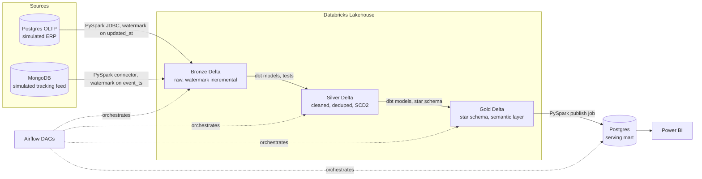
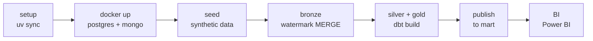

<p align="center">
  
</p>

<h1 align="center">FreightLake</h1>

<p align="center">
  <em>A logistics data platform that ingests orders from a simulated ERP system and shipment tracking events from a simulated IoT feed, refines them through a medallion architecture on Databricks, and publishes a governed star schema to Postgres for BI consumption, all orchestrated end to end by Airflow.</em>
</p>

<p align="center">
  <a href="https://github.com/Nitinx12/Logistics-Medallion-Pipeline/actions/workflows/python-ci.yml"></a>
  <a href="https://github.com/Nitinx12/Logistics-Medallion-Pipeline/actions/workflows/sql-lint.yml"></a>
  <a href="https://github.com/Nitinx12/Logistics-Medallion-Pipeline/actions/workflows/dbt-ci.yml"></a>
  <a href="https://github.com/Nitinx12/Logistics-Medallion-Pipeline/actions/workflows/docker-build.yml"></a>
  <a href="LICENSE"></a>
</p>

<p align="center">
  
  
  
  
  
  
  
  
  
</p>

---

## Architecture





> **Why two sources?** Nearly every real logistics platform has this exact split, a relational system of record plus a high volume loosely structured event stream. Modeling that split is more convincing in an interview than a single flat CSV import.

---

## Quick Start

```bash
git clone https://github.com/Nitinx12/Logistics-Medallion-Pipeline.git
cd Logistics-Medallion-Pipeline
cp .env.example .env
uv sync
python main.py          # setup -> docker -> seed -> bronze -> silver/gold -> publish
```

With Postgres and Mongo already running:

```bash
python main.py --skip-docker
```

Preview the plan without executing:

```bash
python main.py --dry-run
```

PowerShell (Windows):

```powershell
Copy-Item .env.example .env
uv sync
python main.py --skip-docker
# or using the paired scripts:
.\scripts\powershell\setup.ps1
.\scripts\powershell\seed_data.ps1
.\scripts\powershell\run_pipeline.ps1
```

---

## Make Targets

| Target | What it does |
|---|---|
| `make setup` | `uv sync` + check prerequisites |
| `make docker-up` | Start Postgres, MongoDB, Airflow (webserver on port 8090) |
| `make seed` | Load synthetic CSV data into Postgres and MongoDB |
| `make bronze` | Run both PySpark extraction jobs locally |
| `make dbt-build` | `dbt build` — models + tests for Silver and Gold |
| `make dbt-docs` | Generate dbt lineage docs, open `dbt/target/index.html` |
| `make publish` | Publish Gold Delta to Postgres serving mart |
| `make pipeline` | Full run: equivalent to `python main.py` |
| `make lint` | `ruff` + `mypy` + `sqlfluff` |
| `make test` | `pytest` + `dbt test` |
| `make ci` | `lint` + `test` (what CI runs) |
| `make clean` | Remove containers, volumes, and local build artifacts |

---

## What Lives in Each Layer

**Bronze** lands raw with watermark incremental reads. Two jobs pull only rows where `updated_at` or `event_ts` is past the last high watermark stored in `watermarks.json`, then upsert into `delta/bronze/*.parquet` so reruns are idempotent. A `_loaded_at` audit column is added to every row.

**Silver** cleans and conforms. String columns are trimmed (the OLTP source has padded spaces), deduplication and type casting are applied, then `dim_driver` and `dim_vehicle` are built as Slowly Changing Dimensions Type 2 using a `LEAD()` window function with `valid_from`, `valid_to`, and `is_current`. Every model has `not_null`, `unique`, and `relationships` tests.

**Gold** exposes a star schema. Facts `fct_orders`, `fct_shipments`, `fct_deliveries` join to dims `dim_customer`, `dim_driver`, `dim_vehicle`, `dim_warehouse`, `dim_route`, `dim_date`. Three business metrics (`on_time_delivery_rate`, `avg_delivery_time`, `revenue_per_route`) are defined once in `metrics.yml` so dashboards always use the same calculation.

**Publish** keeps BI fast. A PySpark job reads Gold Delta and bulk-inserts into `freightlake_mart.mart.*` in Postgres. BI tools connect to Postgres, not Databricks, for low latency.

---

## Databricks Note

Community Edition is sufficient. If `DATABRICKS_TOKEN` lacks `sql` scope, `main.py` automatically falls back to the local Pandas pipeline (`scripts/run_local_pipeline.py`). Local Delta files and `freightlake_mart` still run completely.

---

## Repo Structure

```
freightlake/
├── main.py                    # single entry point: full pipeline in one command
├── Makefile                   # thin wrappers over scripts/
├── pyproject.toml             # uv project, Python 3.13+
├── .env.example               # all required env vars with placeholder values
├── watermarks.json            # high watermark state per source table/collection
├── docker/
│   ├── compose.yml            # Postgres 16, MongoDB 7, Airflow 3.x
│   └── Dockerfile             # Python job image
├── airflow/dags/
│   ├── freightlake_bronze_dag.py         # 04:00 UTC, parallel extracts, 2h SLA
│   ├── freightlake_silver_gold_dag.py    # 06:00 UTC, dbt build
│   └── freightlake_publish_dag.py        # 07:00 UTC, gold to mart
├── spark_jobs/
│   ├── bronze/
│   │   ├── extract_postgres_oltp.py      # watermark pull from 9 OLTP tables
│   │   └── extract_mongo_tracking.py     # watermark pull from 3 Mongo collections
│   ├── publish/
│   │   └── publish_gold_to_postgres.py   # Gold Delta -> Postgres mart
│   └── utils/
│       ├── logger.py                     # centralized stage-scoped logging
│       ├── connection.py                 # DB connection helpers
│       └── engine.py
├── dbt/
│   ├── dbt_project.yml                   # Silver: incremental/merge, Gold: table
│   ├── models/silver/                    # stg_*, dim_driver (SCD2), dim_vehicle (SCD2)
│   └── models/gold/                      # fct_*, dim_*, metrics.yml
├── sql/
│   ├── oltp_schema/                      # 9 DDL files for Postgres OLTP
│   ├── serving_mart/                     # mart schema DDL
│   └── databricks/                       # Bronze table DDL, schemas, watermark table
├── scripts/
│   ├── seed.py                           # loads data/ CSVs into Postgres and MongoDB
│   ├── run_local_pipeline.py             # full pipeline without Databricks (Pandas)
│   ├── bash/                             # setup, seed, docker, dbt, pipeline scripts
│   └── powershell/                       # Windows equivalents of every bash script
├── data/                                 # 14 synthetic CSV datasets
├── tests/python/                         # pytest for watermark and merge logic
├── great_expectations/                   # GE suite for statistical validation
└── docs/
    ├── PROJECT_PLAN.md                   # full roadmap and 40-term concept map
    ├── AIRFLOW.md                        # DAG schedules, tasks, Docker services
    ├── DATABRICKS.md                     # catalog layout, materialization, setup
    ├── DBT.md                            # models, SCD2 logic, tests, metrics
    ├── PIPELINE.md                       # step-by-step flow with watermark details
    ├── LOCAL_SETUP.md                    # prerequisites, quick start, port table
    ├── POSTGRES.md                       # OLTP and mart schemas, table inventory
    ├── MONGODB.md                        # collections, watermark field, seed behavior
    ├── DATA_QUALITY.md                   # dbt tests, GE suite, quality gate
    ├── DATA_DICTIONARY.md               # Bronze/Silver/Gold table and column reference
    ├── TESTING.md                        # lint, test commands, CI workflows
    ├── TROUBLESHOOTING.md               # port collisions, Airflow keys, watermark resets
    ├── MONITORING.md                     # Airflow UI, logs, watermarks, dbt docs
    └── CONTRIBUTING.md                  # branching, commits, definition of done
```

---

## Docs

| Document | What it covers |
|---|---|
| [ARCHITECTURE.md](ARCHITECTURE.md) | Four Mermaid diagrams, per-layer design decisions |
| [docs/PROJECT_PLAN.md](docs/PROJECT_PLAN.md) | Full roadmap, tech stack, build order, 40-term concept map |
| [docs/PIPELINE.md](docs/PIPELINE.md) | Step-by-step pipeline flow with watermark and fallback details |
| [docs/LOCAL_SETUP.md](docs/LOCAL_SETUP.md) | Prerequisites, quick start, all Make targets, port table |
| [docs/AIRFLOW.md](docs/AIRFLOW.md) | DAG schedules, task breakdown, Docker Airflow services |
| [docs/DATABRICKS.md](docs/DATABRICKS.md) | Catalog layout, Silver/Gold materialization, setup steps |
| [docs/DBT.md](docs/DBT.md) | Models, SCD2 implementation, tests, semantic layer metrics |
| [docs/POSTGRES.md](docs/POSTGRES.md) | OLTP tables, mart schema, connection details |
| [docs/MONGODB.md](docs/MONGODB.md) | Collections, watermark field, seed behavior |
| [docs/DATA_QUALITY.md](docs/DATA_QUALITY.md) | dbt tests, Great Expectations, quality gate logic |
| [docs/DATA_DICTIONARY.md](docs/DATA_DICTIONARY.md) | Full table and column reference for all three layers |
| [docs/TESTING.md](docs/TESTING.md) | Lint/test commands, CI workflow descriptions |
| [docs/TROUBLESHOOTING.md](docs/TROUBLESHOOTING.md) | Port conflicts, Databricks errors, Airflow setup, watermark resets |
| [docs/MONITORING.md](docs/MONITORING.md) | Airflow UI, logs, watermarks, Docker health |
| [docs/CONTRIBUTING.md](docs/CONTRIBUTING.md) | Branching, commit style, paired scripts rule, definition of done |
| [docs/CHANGELOG.md](docs/CHANGELOG.md) | What changed in each version |

---

## License

MIT © 2026 Nitin — see [LICENSE](LICENSE).
