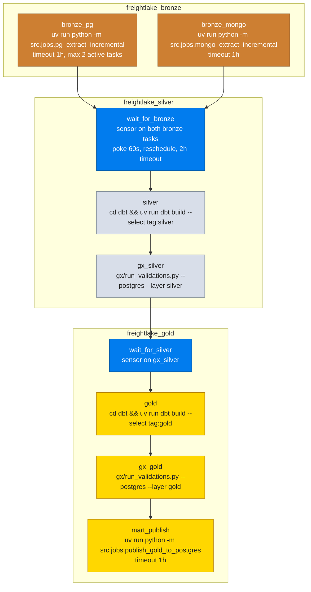

# Airflow

Orchestration design, task breakdown, and the containerized services. The
DAG chaining rationale lives in `ARCHITECTURE.md` section 3.

## DAGs

| DAG | Schedule | Purpose |
|---|---|---|
| `freightlake_bronze` | `@daily` | extract Postgres and Mongo into bronze, both tasks in parallel |
| `freightlake_silver` | `@daily` | build silver with dbt, then run the silver GX gate |
| `freightlake_gold` | `@daily` | build gold with dbt, run the gold GX gate, publish the mart |

All three share `start_date = 2026-01-01`, `catchup = False`, one retry
with a five minute delay, and `DAGS_ARE_PAUSED_AT_CREATION = True` (unpause
them in the UI). Because the schedules and start dates match, the
`ExternalTaskSensor` in silver and gold resolves the upstream run for the
same logical date without an execution delta.

## Task breakdown

Design points:

- **Everything runs through `uv run`.** Inside the container the scheduler
  interpreter is the image's system Python; the project virtual environment
  at `/opt/airflow/.venv` (Python 3.13, managed by uv) is the only place
  pyspark and dbt exist.
- **`mart_publish` is a BashOperator, not a PythonOperator.** The publish
  job needs pyspark; importing it into the scheduler process would fail.
  The CLI invocation gets the project environment and clean process
  isolation.
- **GX tasks have no demo fallback.** A failed validation or an unreachable
  Postgres fails the DAG. Promotion is blocked, which is the point of the
  gate.
- **Sensors use `mode="reschedule"`** so waiting does not occupy a worker
  slot for the full two hour timeout.

## Container services

Defined in `docker/compose.yml`, image built from `docker/Dockerfile` on
`apache/airflow:3.0.6-python3.11` with a uv managed Python 3.13 toolchain
for the project environment.

| Service | Command | Notes |
|---|---|---|
| `postgres` | postgres 16 alpine | holds `freightlake_oltp`, `freightlake_mart`, `airflow`; runs the init scripts on first volume init |
| `mongo` | mongo 7 | the tracking feed source |
| `airflow-init` | `airflow db migrate` + admin user | runs once before the API server |
| `airflow-apiserver` | `airflow api-server` | port 8080, health checked |
| `airflow-scheduler` | `airflow scheduler` | waits on the API server health |
| `dag-processor` | `airflow dag-processor` | required by Airflow 3, never remove it |

The entrypoint (`docker/entrypoint.sh`) waits for Postgres before starting
each role. Inside the containers, `POSTGRES_HOST` and `MONGO_URI` are
overridden to the compose service names, so the `.env` values for the host
(`localhost`) keep working for jobs run outside Docker.

## Volumes and mounting

The compose file mounts the repo into `/opt/airflow` for the Airflow
services: `airflow/dags`, `airflow/logs`, `dbt`, `gx`, `src`, `jars`,
`config`, plus `.env` through `env_file`. The DAGs compute the repo root by
walking up from the dag file to the directory that contains `src/jobs` and
`dbt/dbt_project.yml`, which resolves correctly both on the host (repo
root) and in the container (`/opt/airflow`).

## UI and access

| What | Where |
|---|---|
| Airflow UI | `http://localhost:8080`, user `airflow`, password `airflow` |
| DAG list | three DAGs, tagged `freightlake` |
| REST API | `http://localhost:8080/api/v2`, same credentials |
| Trigger a run | UI or `airflow dags trigger freightlake_bronze` |

Triggering `freightlake_bronze` is enough for a full pass: silver and gold
pick up the completed runs through their sensors within their own daily
schedule, or trigger them manually in order for an immediate chain.
