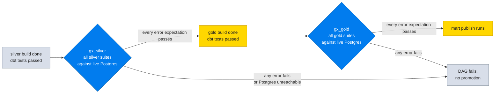

# Data Quality

Two independent systems cover the same contracts: dbt tests validate the
lakehouse tables where they are built, Great Expectations suites validate
the published mart tables where BI reads them. The gate logic is
identical: error severity blocks promotion, warn severity documents a
known issue.

## Gate flow



There is no demo fallback inside the DAGs, deliberately: synthetic data
always passes, so a fallback would make the gate unfailable.

## dbt tests

Attached per column in `dbt/models/silver/_silver.yml` and
`dbt/models/gold/_gold.yml` (the full inventory lives in
`docs/DATA_DICTIONARY.md`). The standard tests plus six generic macros:

| Test | Semantics |
|---|---|
| `not_null`, `unique` | primary keys and watermark columns, always `error` |
| `accepted_values` | closed vocabularies (status, type columns) |
| `relationships` | foreign keys reference the parent model |
| `no_orphan_rows` | generic version of the referential check with its own report |
| `no_empty_strings`, `no_white_spaces` | string hygiene |
| `no_future_dates` | temporal sanity |
| `accepted_range` | numeric bounds |
| `matches_regex` | format contracts (VIN, state codes, ids) |

`dbt build` in the DAGs runs model and tests together, so a failing error
severity test fails the layer's DAG task directly.

## Great Expectations

Eight suites in `gx/expectations/`, each a JSON mirror of the matching dbt
tests:

| Suite | Covers |
|---|---|
| `silver.customers` | customer ids, names, statuses |
| `silver.trucks` | truck ids, VINs, statuses |
| `silver.trailers` | trailer ids, types (warn on duplicate numbers) |
| `silver.trips` | trip ids, distances, statuses |
| `silver.fuel_purchases` | purchase ids, volumes, costs (warn on null truck id) |
| `gold.dim_customers` | surrogate keys, SCD2 flags |
| `gold.dim_date` | spine completeness, 1572 expected rows |
| `gold.fact_loads` | load ids, charges, unmatched flags |

The runner, `gx/run_validations.py`:

```bash
uv run python gx/run_validations.py --list                    # inventory
uv run python gx/run_validations.py --demo                    # synthetic, no DB
uv run python gx/run_validations.py --demo --bad-demo         # see a failure
uv run python gx/run_validations.py --postgres --layer silver # the DAG gate
uv run python gx/run_validations.py --postgres --all          # everything
```

Demo mode evaluates the suites against synthetic pandas frames with a
lightweight evaluator, so CI without a database can still exercise the
rule definitions. Postgres mode reads the mart tables (up to 10000 rows
per table, trying `silver.`, `gold.`, then `public.` schemas) through
`get_postgres_engine()`.

## Known issues tracked as warn

Documented upstream gaps, mirrored between the dbt yml (severity warn) and
the GX suite meta severity warn:

| Issue | Where | Detail |
|---|---|---|
| Null `truck_id` on fuel purchases | `silver.fuel_purchases` | 3880 nulls observed 2026-09-11, orphan fuel cards with no matching truck |
| Duplicate `trailer_number` | `silver.trailers` | 4 duplicates observed, active trailers sharing numbers |
| Future rows in `dim_date` | `gold.dim_date` | by design: the spine runs to 2030, future dates are expected |

Never promote a warn to passing silently, and never lower an error to a
warn to make a build pass (AGENTS.md rule): fix the data or add the issue
to this table.

## Adding a new rule

1. Add the dbt test to `_silver.yml` or `_gold.yml`.
2. Add the matching expectation to `gx/expectations/<layer>_<model>.json`
   with the same severity.
3. Verify both: `uv run python gx/run_validations.py --demo --suite
   <suite>` and the dbt build.
4. Update `docs/DATA_DICTIONARY.md` for the new test and this page if the
   rule introduces or resolves a known issue.
