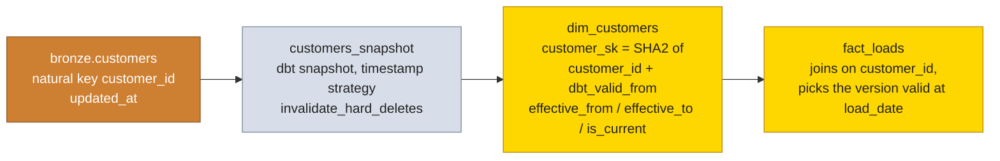

# dbt

Model inventory, the SCD2 implementation, the test suite, and how dbt is
invoked. Layer design rationale lives in `ARCHITECTURE.md`.

## Project layout

```text
dbt/
  dbt_project.yml        layer config: tags, materializations, schemas
  profiles.yml           env var only credentials, three targets
  models/
    bronze/sources.yml   the 12 bronze source definitions
    silver/              12 models + _silver.yml tests
    gold/                14 models + _gold.yml tests
  macros/
    create_udfs.sql      on-run-start hook (placeholder)
    generate_schema.sql  custom schema naming, schemas used verbatim
  snapshots/
    customers_snapshot.sql  SCD2 source of truth for dim_customers
  tests/generic/         six shared test macros
  tests/singular/        reserved for singular tests (currently empty)
```

`dbt_project.yml` assigns the `silver` and `gold` tags that the Airflow
DAGs select on. Without those tags the `dbt build --select tag:silver` and
`tag:gold` invocations select nothing, which is why they are set
explicitly rather than left to folder naming.

## Models

### Silver, 12 models

All incremental with the merge strategy, unique key on the primary key,
`on_schema_change='sync_all_columns'`, the same shape: filter to the
watermark lookback when incremental, deduplicate with `ROW_NUMBER`,
select the clean columns.

| Model | Primary key | Notable columns |
|---|---|---|
| `customers` | `customer_id` | credit terms, freight type, account status |
| `drivers` | `driver_id` | license, terminal, employment status |
| `facilities` | `facility_id` | geo coordinates, dock doors |
| `routes` | `route_id` | origin and destination, rates |
| `trucks` | `truck_id` | VIN, mileage, tank capacity |
| `trailers` | `trailer_id` | type, length, location |
| `loads` | `load_id` | customer and route links, revenue |
| `trips` | `trip_id` | driver, truck, trailer links, distance, MPG |
| `fuel_purchases` | `fuel_purchase_id` | gallons, price, fuel card |
| `delivery_events` | `event_id` | pickup and delivery milestones, on time flag |
| `maintenance_records` | `maintenance_id` | labor, parts, downtime |
| `safety_incidents` | `incident_id` | incident type, costs, claim |

### Gold, 14 models

| Model | Kind | Grain |
|---|---|---|
| `dim_customers` | dimension, SCD2 | one row per customer version |
| `dim_drivers` | dimension | one row per driver |
| `dim_facilities` | dimension | one row per facility |
| `dim_routes` | dimension | one row per route |
| `dim_trucks` | dimension | one row per truck |
| `dim_trailers` | dimension | one row per trailer |
| `dim_date` | dimension | one row per day, 2020 through 2030 |
| `fact_loads` | fact | one row per load |
| `fact_trips` | fact | one row per trip |
| `fact_fuel_purchases` | fact | one row per fuel purchase |
| `fact_delivery_events` | fact | one row per delivery event |
| `fact_maintenance_records` | fact | one row per maintenance record |
| `fact_safety_incidents` | fact | one row per incident |
| `fact_operations` | aggregate fact | one row per day with any activity |

Every dimension ends with an `UNKNOWN` member row (UNION ALL) so fact
foreign keys stay not null for unmatched natural keys, and the facts carry
`is_unmatched_*` or `is_unassigned` flags to preserve that signal.

## SCD Type 2 on customers



The snapshot uses the timestamp strategy keyed on `customer_id` with
`invalidate_hard_deletes=True`, so a deleted customer gets a closed
validity window instead of disappearing. The surrogate key includes the
validity start, which makes each historical version addressable by its own
key.

## Tests

Standard tests (not null, unique, accepted values, relationships) plus six
generic macros under `dbt/tests/generic/`:

| Generic test | Checks |
|---|---|
| `no_empty_strings` | no `''` values in the column |
| `no_white_spaces` | no leading or trailing spaces |
| `no_future_dates` | no dates in the future |
| `no_orphan_rows` | every child row matches a parent row |
| `accepted_range` | numeric values within min and max |
| `matches_regex` | values match a regex |

Severity rules: primary keys and watermarks are `error` on not null and
unique; referential checks on soft references are frequently `warn` where
the source genuinely produces orphans (documented in
`docs/DATA_QUALITY.md`). Never lower a severity to make a build pass; fix
the data or document the known issue.

## Commands

```bash
# from the repo root
cd dbt && uv run dbt build --select tag:silver --profiles-dir .
cd dbt && uv run dbt build --select tag:gold

# docs (regenerate after any model change, before committing)
cd dbt && uv run dbt docs generate --profiles-dir .
cd dbt && uv run dbt docs serve --profiles-dir .

# tests only
cd dbt && uv run dbt test --profiles-dir .
```

`dbt build` runs models and their tests together, which is what the
Airflow DAGs rely on: a failing error severity test fails the DAG.
