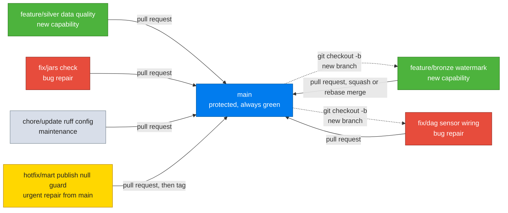
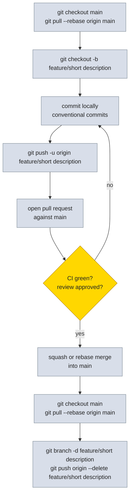
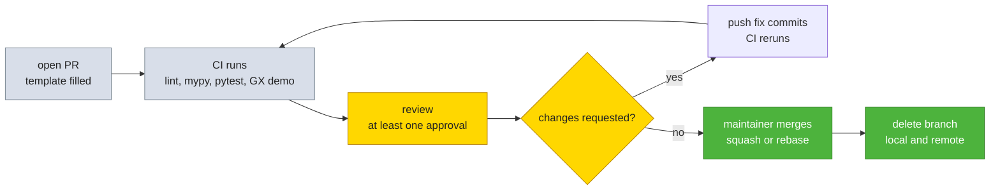

# Git Workflow

How code moves from a local branch to `main` in FreightLake. The short version lives in `AGENTS.md` section 3 and `docs/CONTRIBUTING.md`; this document is the full reference.

## 1. Principles

* `main` is always deployable. Every commit on `main` has passed the full quality gate.
* No direct commits to `main`. All work goes through a pull request.
* Small focused commits. One logical change per commit.
* History should be readable. Use conventional commits and keep branches current with rebase.

## 2. Branching model



### Branch names

| Prefix | Use | Example |
|---|---|---|
| `feature/` | New capability or enhancement | `feature/bronze watermark` -> `feature/bronze-watermark` |
| `fix/` | Bug repair | `fix/dag-sensor-wiring` |
| `chore/` | Tooling, config, docs, dependency update | `chore/update-ruff-config` |
| `hotfix/` | Urgent repair branched directly from `main` | `hotfix/mart-publish-null-guard` |
| `docs/` | Documentation only change | `docs/git-workflow` |
| `prototype/` | Experimental work that will not be merged as is | `prototype/main` |

Use lowercase with hyphens to separate words in the branch name itself. Keep names short.

### Branch lifecycle



## 3. Commit conventions

Conventional commits are required. Every commit message follows this shape:

```
type(scope): description

[optional body]

[optional footer]
```

### Types

| Type | Meaning |
|---|---|
| `feat` | New capability |
| `fix` | Bug repair |
| `chore` | Tooling, build, or maintenance |
| `docs` | Documentation only |
| `refactor` | Code change that does not fix a defect and does not add capability |
| `test` | Adding or updating tests |
| `perf` | Performance improvement |
| `ci` | CI or workflow change |
| `build` | Build system or dependency change |

### Scope

Use the area of the repository that the change touches: `bronze`, `silver`, `gold`, `mart`, `airflow`, `docker`, `dbt`, `gx`, `tests`, `deps`, `docs`, `scripts`. The scope is lowercase.

### Examples

```
feat(bronze): add watermark upsert for mongo tracking events

fix(airflow): chain DAGs with ExternalTaskSensor

chore(deps): bump ruff to 0.16.1

docs(workflow): add git workflow reference

test(silver): cover three day lookback edge case
```

### Commit hygiene

* Write the description in imperative mood: add, fix, update, not added or fixes.
* Keep the first line to about 72 characters.
* Keep commits small and focused. Do not bundle an unrelated formatting pass into a capability commit.
* Amend only a commit that has not been pushed: `git commit --amend`.

## 4. Daily workflow

### Start new work

```bash
git checkout main
git pull --rebase origin main
git checkout -b feature/short-description
```

### Save work

```bash
git status
git diff
git add <path>
git commit -m "type(scope): description"
```

Stage only what the commit needs. Use `git add <path>` or `git add -p` for partial staging. Avoid `git add .` unless you have verified `git status`.

### Keep your branch current

```bash
git fetch origin
git rebase origin/main
```

If the branch is already shared with others, use merge instead of rebase:

```bash
git merge origin/main
```

Never rebase a branch that others have pulled without agreement.

### Push and open a pull request

```bash
git push -u origin feature/short-description
```

Then open a pull request on GitHub against `main` using the pull request template at `.github/pull_request_template.md`. The first push uses `-u` to set the upstream. Later pushes use `git push`.

If you rewrote local history on your own unshared branch:

```bash
git push --force-with-lease
```

Never use `--force` on `main` or any shared branch.

## 5. Pull request process



### Before opening a pull request

Run the same gate CI runs:

```bash
uv run ruff check .
uv run ruff format --check .
uv run mypy .
uv run pytest
uv run python gx/run_validations.py --demo
scripts/bash/run_all_tests.sh
```

For dbt changes also run:

```bash
cd dbt && uv run dbt build --profiles-dir .
cd dbt && uv run dbt docs generate --profiles-dir .
```

### Pull request requirements

* Fill every section of the pull request template.
* Link related issue if one exists.
* Keep the pull request focused on one topic. Split unrelated changes into separate pull requests.
* Every new or changed dbt model has `not_null` and `unique` tests on its primary key plus `relationships` tests on foreign keys, and appears in `dbt docs generate` output.
* Every new Bash script has its PowerShell counterpart under `scripts/powershell/` with the same behavior and summary output.
* No secret, token, or credential appears in the diff. `.env` is ignored and must never be committed.
* After a dbt model change, commit the regenerated docs in the same pull request.

### Review

* At least one reviewer must approve.
* Address every comment or mark it as resolved with a reply.
* Keep review scope to correctness, tests, docs, and style. Follow `ruff` and `sqlfluff` for formatting rather than debating style in review.

### Merge strategy

| Strategy | When to use |
|---|---|
| Squash and merge | Default for feature branches with many small fixup commits. Produces one clean commit on `main`. |
| Rebase and merge | When commit history is already clean and each commit is valuable on its own. |
| Merge commit | Rare. Only for long lived branches where preserving branch topology matters. |

Delete the branch after merge:

```bash
git checkout main
git pull --rebase origin main
git branch -d feature/short-description
git push origin --delete feature/short-description
```

## 6. Release and versioning

Tags mark releases on `main`. The project uses semantic versioning: `vMAJOR.MINOR.PATCH`.

```bash
git checkout main
git pull --rebase origin main
git tag -a v0.2.0 -m "feat: add gold star schema and mart publish"
git push --tags
```

Releases are created from tags on GitHub. Use the changelog at `docs/CHANGELOG.md` to group changes by type.

Hotfix flow for urgent repair:

```bash
git checkout main
git pull --rebase origin main
git checkout -b hotfix/short-description
# fix, test, commit
git push -u origin hotfix/short-description
# open PR, get review, merge, then tag
git checkout main
git pull --rebase origin main
git tag -a v0.2.1 -m "fix(mart): guard null publish"
git push --tags
```

## 7. Handling common situations

### Stash work in progress

```bash
git stash push -m "wip: bronze chunk fallback"
git stash list
git stash pop
```

### Undo last commit but keep edits

```bash
git reset --soft HEAD~1
```

### Discard local changes to a file

```bash
git restore <path>
```

### Unstage a file but keep edits

```bash
git restore --staged <path>
```

### Sync fork with upstream

```bash
git fetch origin
git checkout main
git merge origin/main
git push
```

## 8. Secrets and safety

* All credentials come from `.env`, loaded through environment variables. `.env.example` documents every required variable with a placeholder value, never a real one.
* `dbt/profiles.yml` reads Databricks credentials from environment variables only. Never hardcode a host, token, or HTTP path.
* If a secret is accidentally staged, unstage it before committing:

```bash
git restore --staged .env
```

Confirm `.gitignore` covers it, then commit.

* Do not add a new external service call, API key, or telemetry hook without flagging it clearly in the pull request description.

## 9. CI overview

Every pull request against `main` triggers `.github/workflows/ci.yml`. The workflow runs on `ubuntu-latest` with Python 3.13 and `uv`:

1. `uv sync --all-groups`
2. `uv run ruff check .` and `uv run ruff format --check .`
3. `uv run sqlfluff lint` for SQL and dbt models
4. `uv run mypy .`
5. `uv run pytest tests/unit tests/gx_tests -q`
6. `uv run python gx/run_validations.py --demo`

The full gate `scripts/bash/run_all_tests.sh` is also runnable locally. CI blocks merge on any failure. Never change a test severity from `error` to `warn` to make a build pass; fix the underlying data or model instead.

## 10. Quick command reference

| Action | Command |
|---|---|
| Check status | `git status` |
| See unstaged changes | `git diff` |
| See staged changes | `git diff --staged` |
| View history | `git log --oneline --graph --decorate` |
| Stage a file | `git add <path>` |
| Commit | `git commit -m "type(scope): description"` |
| Amend last commit | `git commit --amend` |
| New branch | `git checkout -b feature/short-description` |
| Switch branch | `git checkout <branch>` |
| Push new branch | `git push -u origin feature/short-description` |
| Push | `git push` |
| Pull with rebase | `git pull --rebase` |
| Fetch without merge | `git fetch origin` |
| Merge main into branch | `git merge origin/main` |
| Rebase onto main | `git rebase origin/main` |
| Stash | `git stash` |
| Restore stash | `git stash pop` |
| Unstage file | `git restore --staged <path>` |
| Discard changes | `git restore <path>` |
| Tag | `git tag -a v0.1.0 -m "message"` |
| Push tags | `git push --tags` |

Related documents: `AGENTS.md` section 3, `docs/CONTRIBUTING.md`, `docs/TESTING.md`, `ARCHITECTURE.md` section 3.

