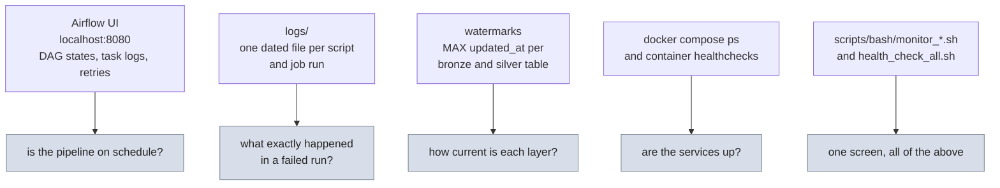

# Monitoring

Where to look when you want to know what the pipeline is doing right now,
and what it did last night.

## The monitoring map



## Airflow UI

`http://localhost:8080`, user `airflow`, password `airflow`.

| Where | What to check |
|---|---|
| DAG list, filtered by the `freightlake` tag | all three DAGs unpaused, no red runs |
| `freightlake_bronze` graph view | `bronze_pg` and `bronze_mongo` side by side |
| `freightlake_silver` / `freightlake_gold` | sensor cleared, then build, gate, (publish) |
| Task instance logs | the full stdout of the dbt build, GX run, or Spark job |
| SLA and retries | tasks retry once after five minutes by default |

The GX gate tasks are the ones that go red when data quality fails; their
logs name the exact suite and expectation that failed.

## Log files

Every script and job writes to `logs/` with a dated name, through
`src/utils/logger.py`:

| Pattern | Producer |
|---|---|
| `pg_extract_incremental_<date>.log` | Postgres extraction job |
| `mongo_extract_incremental_<date>.log` | Mongo extraction job |
| `publish_gold_to_postgres_<date>.log` | mart publisher |
| `run_gx_<date>.log` | the GX gate script |
| `start_stack_<date>.log`, `stop_stack_<date>.log` | stack lifecycle |
| `run_all_tests_<date>.log` | the full quality gate |
| `monitor_*_<date>.log` | the monitors below |
| `connection_<date>.log` | connection events from `connections.py` |

Console output of the Spark jobs is intentionally quiet (console level
WARNING); the log files carry the INFO detail.

## Monitor scripts

| Script | Shows |
|---|---|
| `scripts/bash/health_check_all.sh` | one shot: Postgres, Mongo, Airflow, jars present |
| `scripts/bash/monitor_postgres.sh` | database sizes, row counts per OLTP table |
| `scripts/bash/monitor_mongo.sh` | collection counts and stats |
| `scripts/bash/monitor_airflow.sh` | DAG states and recent task outcomes through the API |
| `scripts/bash/monitor_dbt.sh` | latest run results from `dbt/target/` |

Each logs to `logs/monitor_*_<date>.log` while it prints.

## Watermarks: how fresh is each layer

The watermark is `MAX(updated_at)` in each target table, so freshness is
one query per layer:

```sql
-- bronze, in a Databricks warehouse
SELECT MAX(updated_at) FROM freightlake.bronze.trips;

-- silver and gold, in the mart
SELECT MAX(updated_at) FROM silver.trips;
```

For the mart, `fact_operations.ops_date` is the quickest single freshness
number: the latest day with any pipeline activity.

## Docker health

```bash
docker compose ps                        # from docker/, state and health per service
docker compose logs airflow-scheduler --tail 50
docker stats                             # resource pressure
```

Health checks in `docker/compose.yml`: `pg_isready` for Postgres,
`db.adminCommand('ping')` for Mongo, the Airflow v2 monitor endpoint for
the API server. `start_stack.sh` waits on all of them and rolls back on
timeout, so a stack that comes up is a stack that is healthy.

## Alerting (future work)

Nothing here pages anyone yet. The natural next steps, in order: an
Airflow SLA miss callback, a GX gate failure notification, and a
freshness check that warns when any bronze watermark is older than two
days.
