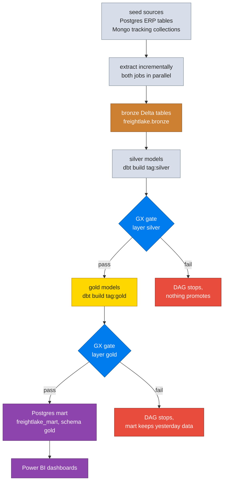

# Pipeline

Step by step walkthrough of one full pipeline run, with the watermark math
and the fallback behavior spelled out. The big picture lives in
`ARCHITECTURE.md`; this page follows the data.

## End to end flow



## Stage 1: bronze extraction

Both extraction jobs (`src/jobs/pg_extract_incremental.py` and
`src/jobs/mongo_extract_incremental.py`) run the same algorithm; one reads
through the JDBC driver, the other through the Spark Mongo connector.

### Step by step, per table or collection

1. **Discover targets.** With no `--table` flag, the job lists every base
   table in the source schema (Postgres `information_schema`) or every
   collection in `MONGO_DB` (`list_collection_names`), minus
   `--exclude-tables`.
2. **Check the watermark column.** Tables without `updated_at` are handled
   per `--no-updated-at-mode`: `overwrite` (default) does a full snapshot
   replace each run, `skip` leaves them alone.
3. **Resolve the watermark.**
   - `--full` forces a full load.
   - `--since` overrides the watermark with an explicit timestamp.
   - Otherwise, if the target Delta table exists, the watermark is
     `MAX(updated_at)` from the target. If it does not exist, this is a
     full load starting from `MIN(updated_at)` in the source.
4. **Capture source bounds once.** `MIN` and `MAX` of `updated_at` are read
   up front so every chunk reads one consistent snapshot instead of a
   moving target.
5. **Build the window plan.** `build_windows(start, end, chunk_days,
   full_load)` splits the range into seven day windows:
   - full load: the very first window's lower bound is inclusive, because
     `MIN(updated_at)` has never been captured;
   - incremental: every lower bound is exclusive, because the watermark was
     already captured inclusively last run;
   - `start == end` on a full load is a real case (bulk seeded data where
     every row shares one timestamp) and yields exactly one window; the
     same condition on an incremental run correctly yields none.
6. **Read a window.** A `WHERE updated_at > start AND updated_at <= end`
   predicate is pushed into the source query, with four parallel JDBC
   connections partitioned on the watermark column when
   `--num-partitions` is greater than one.
7. **Write the chunk** through the configured write mode, then move to the
   next window. Each chunk is persisted and counted before writing so the
   row counts in the summary are exact.

### Write mode fallback

If a Unity Catalog managed or external write raises the outside compute
403 (ErrorCode 5108 or 5105, or the external create table denial), the job
logs a warning and retries the same chunk through the SQL warehouse path.
If that also fails, the run fails loudly. See the write path diagram in
`ARCHITECTURE.md`.

### Watermark example

```text
Target table exists, MAX(updated_at) in target = 2026-09-10 14:00
Source MAX(updated_at)                  = 2026-09-12 09:30
=> incremental run over (2026-09-10 14:00, 2026-09-12 09:30]
   with 7 day chunking this is a single window
   next run's watermark becomes 2026-09-12 09:30
```

## Stage 2: silver build

`dbt build --select tag:silver` compiles every silver model with this shape:

1. Read from `source('bronze', '<table>')`.
2. When incremental, filter to rows at or newer than the model's own
   `MAX(updated_at)` minus three days (the lookback absorbs late updates;
   the merge makes the overlap idempotent).
3. Deduplicate with `ROW_NUMBER() OVER (PARTITION BY <primary key> ORDER BY
   updated_at DESC)`, keeping rank 1.
4. Merge into the silver table on the primary key with
   `on_schema_change='sync_all_columns'`.
5. Run every test attached to the model; a failing error severity test
   fails `dbt build` and therefore the DAG.

## Stage 3: silver quality gate

`gx/run_validations.py --postgres --layer silver` validates every silver
suite against the mart Postgres. Any error severity expectation failure, or
an unreachable Postgres, exits non zero and fails the `gx_silver` task, so
gold never builds on top of a layer that failed its contract.

## Stage 4: gold build

`dbt build --select tag:gold` rebuilds the star schema as tables:

- dimensions join silver models and hash their keys; unmatched natural keys
  fall back to the UNKNOWN member surrogate key;
- facts join dimensions on natural keys and carry both the surrogate key
  and the original id, plus date keys in `yyyyMMdd` integer form;
- `fact_operations` aggregates trips, loads, fuel, maintenance and safety
  per day with full outer joins on the date;
- `dim_customers` reads the snapshot, exposing SCD2 validity columns.

## Stage 5: gold quality gate

Same mechanics as the silver gate, over the gold suites.

## Stage 6: mart publish

`src/jobs/publish_gold_to_postgres.py` iterates the fourteen gold tables
(see `DEFAULT_GOLD_TABLES`), and for each one:

1. Read the gold table from Unity Catalog, or from local Delta in local
   mode, or synthesize demo data with `--demo`.
2. Repartition to 4 for parallel JDBC.
3. Ensure the `gold` schema exists in `freightlake_mart`.
4. Overwrite the mart table through Spark JDBC with `batchsize=10000` and
   `truncate=true`.

A missing gold source table is a skip with a logged reason, not a run
failure; anything else fails the table with the error captured in the
summary. Mart indexes from `sql/serving_mart/indexes.sql` survive the
overwrite and keep BI queries fast.

## Rerun and recovery behavior

| Situation | What to do | Guarantee |
|---|---|---|
| Bronze chunk failed mid run | rerun the job | already written chunks are excluded by the watermark |
| Silver build failed | rerun `dbt build` | merge on primary key, no duplicates |
| Gold build failed | rerun `dbt build` | gold is tables, full rebuild each run |
| Publish failed mid table | rerun the publisher | each table is truncate plus insert, table level atomicity |
| Wrong data landed in bronze | `--full` reload for that table | full load truncates the target first in warehouse and local modes |
| Watermark is wrong (clock skew) | `--since 2026-01-01T00:00:00` | explicit override, windows rebuild from there |
