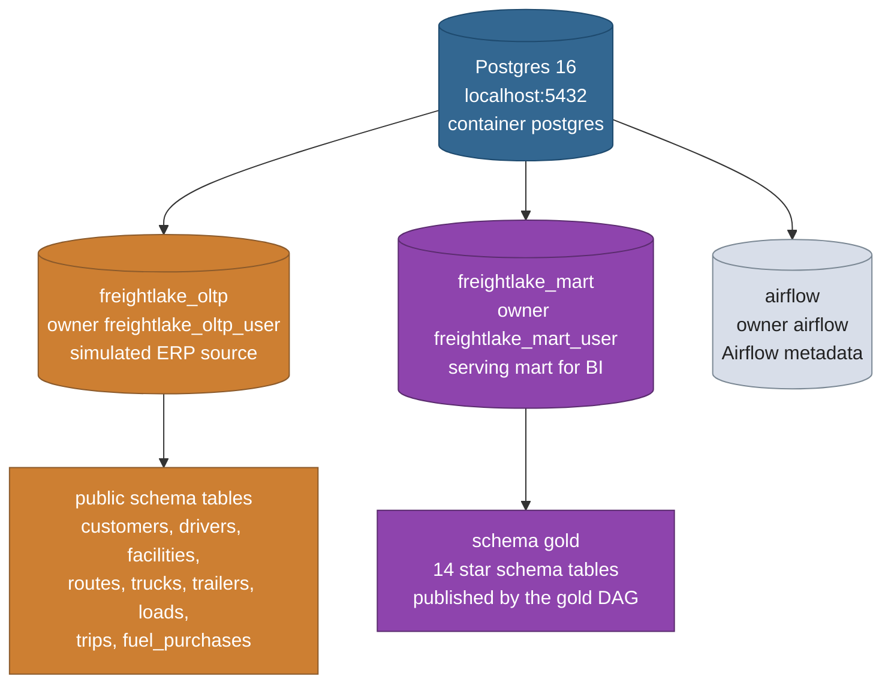

# Postgres

One Postgres 16 instance, three databases, three roles. Everything is
created on first volume init by the scripts in `docker/init/`.

## Databases

| Database | Purpose | Read by | Written by |
|---|---|---|---|
| `freightlake_oltp` | simulated ERP source system | bronze JDBC extraction | seed data (phase 12, DDL belongs in `sql/oltp_schema/`) |
| `freightlake_mart` | serving mart for Power BI | BI tools, the GX gate | `publish_gold_to_postgres` |
| `airflow` | Airflow metadata | the Airflow services | Airflow itself |

## Roles and users

`docker/init/01_create_database.sql` creates three login roles
(`freightlake_oltp_user`, `freightlake_mart_user`, `airflow`), one database
per role with matching ownership, and grants. Passwords come from the
compose environment (defaults `changeme` for the data roles, `airflow` for
Airflow, all local development values).

## OLTP tables (Postgres source)

Nine ERP tables live here, all with an `updated_at` column that drives the
bronze watermark:

`customers`, `drivers`, `facilities`, `routes`, `trucks`, `trailers`,
`loads`, `trips`, `fuel_purchases`.

The three tracking feed collections (`delivery_events`,
`maintenance_records`, `safety_incidents`) come from MongoDB, not Postgres;
see `docs/MONGODB.md`. Column detail for every table lives in
`docs/DATA_DICTIONARY.md`.

The DDL and seed data for these tables belong in `sql/oltp_schema/` and are
applied by `docker/init/02_oltp_schema.sh` on first volume init. That
folder currently holds only its README, which is the open gap tracked in
`docs/PROJECT_PLAN.md` phase 12.

## Mart schema

The publisher writes the 14 gold tables into the `gold` schema of
`freightlake_mart`, one mart table per gold model, same names. Every fact
gets foreign key and date key indexes from `sql/serving_mart/indexes.sql`
(run once after the first publish), for example
`idx_fact_trips_driver_sk ON gold.fact_trips (driver_sk)`.

## Connections

| From | To | How |
|---|---|---|
| host jobs (`uv run` from the repo root) | any database | `POSTGRES_HOST=localhost:5432` from `.env` |
| Airflow containers | any database | compose override `POSTGRES_HOST=postgres` |
| bronze extraction (JDBC) | `freightlake_oltp` | `postgres_jdbc_options()`, prefers the `POSTGRES_OLTP_*` split vars |
| mart publisher (JDBC) | `freightlake_mart` | `postgres_jdbc_url()`, prefers the `POSTGRES_MART_*` split vars |
| GX gate (SQLAlchemy) | `freightlake_mart` | `get_postgres_engine()`, mart aware |
| dbt `mart` target | `freightlake_mart` | `dbt/profiles.yml`, schema `gold` |

The legacy single database variables (`POSTGRES_DATABASE`,
`POSTGRES_USERNAME`, `POSTGRES_PASSWORD`) remain as fallbacks everywhere,
so a single database setup still works.
