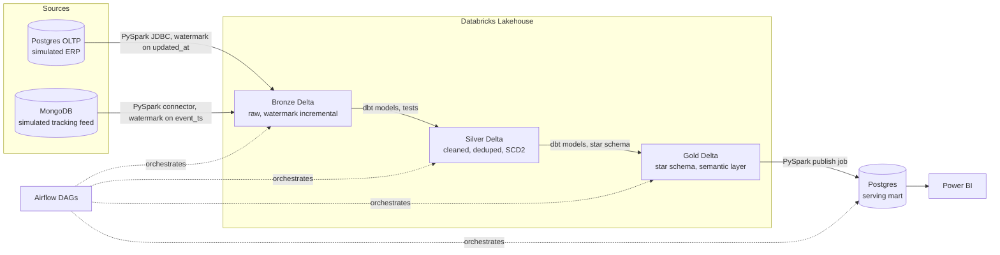

# FreightLake — Logistics Medallion Pipeline

A portfolio grade end to end ETL project built around a logistics domain. It combines
MongoDB, PostgreSQL, and Databricks across a bronze, silver, gold medallion
architecture, orchestrated by Airflow, containerized with Docker, and automated
through a Makefile plus paired Bash and PowerShell scripts.

The project is deliberately scoped so that nearly every term in your SQLNest "40
Data Engineering Terms" checklist has a concrete, working example inside the repo.
Section 19 below maps every term to the exact file or component that demonstrates
it, so this project doubles as interview prep material you built yourself.

> Rename freely. "FreightLake" is a placeholder that signals the logistics plus
> lakehouse angle. Swap it for whatever fits your portfolio naming pattern.

---

## 1. One line pitch

*A logistics data platform that ingests orders from a simulated ERP system and
shipment tracking events from a simulated IoT feed, refines them through a
medallion architecture on Databricks, and publishes a governed star schema to
Postgres for BI consumption, all orchestrated end to end by Airflow.*

---

## 2. Goals and non goals

**Goals**
- Show a realistic two source ingestion pattern (structured relational plus
  semi structured document data), not just a single CSV to warehouse toy example.
- Demonstrate the full medallion pattern with real design decisions at each layer
  (watermarks, SCD Type 2, star schema, data quality gates).
- Show orchestration, containerization, and CI/CD as first class citizens, not an
  afterthought bolted on at the end.
- Produce documentation good enough that a stranger (or an interviewer) can read
  the README and ARCHITECTURE files and understand the whole system in five
  minutes.

**Non goals**
- True streaming (Kafka/Flink) is listed as a stretch goal only. Building it fully
  would double the project size for limited added interview value versus batch
  plus CDC, which is what most roles actually ask about.
- Multi tenant security or row level access control. Out of scope for a solo
  portfolio project.

---

## 3. Tech stack

| Layer | Technology | Role |
|---|---|---|
| Simulated source (structured) | PostgreSQL | Plays the part of an operational ERP: customers, orders, drivers, vehicles, warehouses, routes |
| Simulated source (semi structured) | MongoDB | Plays the part of a tracking or IoT feed: GPS pings, delivery status events, exceptions |
| Lakehouse | Databricks (Delta Lake) | Bronze, silver, gold layers; PySpark and dbt run here |
| Transformation | dbt (dbt core, databricks adapter) | Silver and gold modeling, tests, docs, lineage |
| Distributed processing | PySpark | Extraction jobs from Postgres and Mongo into bronze Delta tables |
| Orchestration | Apache Airflow (Docker) | Schedules and chains bronze, silver/gold, and publish DAGs |
| Serving warehouse | PostgreSQL (separate mart schema or database) | Final star schema for BI tools, reverse ETL target from Databricks gold |
| BI (stretch) | Power BI | Connects to the Postgres serving mart |
| Data quality | dbt tests, Great Expectations | Null, uniqueness, referential integrity, distribution checks |
| Containers | Docker, Docker Compose | Postgres, Mongo, Airflow, and the Python job image |
| Automation | Makefile, Bash, PowerShell | One command setup, seed, run, test, teardown on either OS |
| Package management | `uv` | All Python environments, no bare pip |
| CI/CD | GitHub Actions | Lint, type check, dbt test, docker build, on every pull request |
| Languages | SQL, Python, Bash, PowerShell, YAML | See section 13 for where each is used |

---

## 4. High level architecture



Why two sources instead of one: nearly every real logistics platform has this
exact split, a relational system of record for orders and master data, plus a
high volume, loosely structured event stream for tracking. Modeling that split
is far more convincing in an interview than a single flat CSV import.

---

## 5. Source systems

> **Note (updated 2026-09-10):** The table and collection names below reflect
> the actual implementation. They diverged from the original design names during
> implementation (`warehouses` became `facilities`, `vehicles` became `trucks`
> and `trailers`, `orders`/`order_items` became `loads`/`trips`, etc.). The
> architecture and data model are unchanged; only the names differ.

### 5.1 Postgres OLTP (simulated ERP)

Tables, all with `updated_at` for incremental extraction:

- `customers`
- `drivers` (employment status changes over time, feeds the driver SCD Type 2 dimension)
- `trucks` (status changes over time, feeds the vehicle SCD Type 2 dimension)
- `trailers`
- `facilities` (warehouses, cross-docks, and terminals)
- `routes`
- `loads` (the freight order, one load per customer shipment)
- `trips` (the physical movement, one trip per load)
- `fuel_purchases`

### 5.2 MongoDB (simulated tracking feed)

Collections, all documents carrying an `event_ts` or `updated_at`:

- `delivery_events` — pickup and delivery confirmation events per load, includes
  on-time flag and detention minutes
- `safety_incidents` — accidents, DOT violations, and equipment damage reports
  linked to trips and drivers
- `maintenance_records` — truck maintenance history linked to truck and facility

Seed both sources from the same synthetic dataset generator (Python, Faker) so
row counts and foreign keys line up across systems.

---

## 6. Medallion layers in detail

### Bronze (Databricks Delta, raw)

- One PySpark job per source: `extract_postgres_oltp.py`, `extract_mongo_tracking.py`
- Both use a watermark table (`etl_watermark`, matching your existing
  convention) to pull only new or changed rows since the last successful run
- Loads land as `MERGE INTO` upserts keyed on business or event id, giving you
  idempotency by construction — reruns never duplicate data
- Written as partitioned Parquet under Delta (partition by ingestion date)
- Minimal transformation: type casting and a `_loaded_at` audit column only

### Silver (dbt models on Databricks)

- Cleaning, deduplication, standardized column names and types
- `dim_driver` and `dim_vehicle` implemented as SCD Type 2 (`dbt snapshot` or a
  custom incremental merge model) with `valid_from`, `valid_to`, `is_current`
- Data quality tests: not null, unique, relationships (referential integrity),
  accepted values; a Great Expectations suite runs alongside dbt tests for a
  second, framework independent quality gate
- Schema evolution handled through Delta's built in schema merge, so a new
  field appearing in `tracking_events` does not break the pipeline

### Gold (dbt models on Databricks, star schema)

- Facts: `fct_orders`, `fct_shipments`, `fct_deliveries`
- Dimensions: `dim_customer`, `dim_driver`, `dim_vehicle`, `dim_warehouse`,
  `dim_route`, `dim_date`
- A small semantic layer (`metrics.yml` or dbt Semantic Layer if your dbt
  version supports it) defining shared metrics such as on time delivery rate,
  average delivery time, and revenue per route, so the definition lives in one
  place instead of being recalculated differently by every dashboard

### Publish (PySpark job, gold to Postgres)

- `publish_gold_to_postgres.py` reads the gold Delta tables and writes them to
  a dedicated Postgres serving schema, again through watermark based upserts
- This is the layer Power BI or any BI tool would connect to, kept small and
  fast rather than querying Databricks directly for every dashboard click

---

## 7. Orchestration (Airflow)

Three DAGs, chained by `ExternalTaskSensor` or dataset aware scheduling
(Airflow 3.x asset scheduling if you want to show the newer pattern):

1. `freightlake_bronze_dag` — runs both extraction jobs in parallel, daily
2. `freightlake_silver_gold_dag` — triggers `dbt build` (models plus tests),
   downstream of bronze, fails the run if the data quality gate does not pass
3. `freightlake_publish_dag` — runs the publish job, downstream of a
   successful silver/gold run

Add an SLA on the bronze DAG (for example, must finish by 6 AM) and a dbt
source freshness check on both raw sources, giving you a live example of term
40 from the guide (SLA, SLO, and data freshness) instead of just a definition.

---

## 8. Repository layout

```
freightlake/
├── AGENTS.md
├── README.md
├── ARCHITECTURE.md
├── PROJECT_PLAN.md
├── Makefile
├── pyproject.toml
├── .env.example
├── .gitignore
├── docker/
│   ├── Dockerfile
│   ├── entrypoint.sh
│   ├── compose.yml
│   └── requirements.txt
├── airflow/
│   └── dags/
│       ├── freightlake_bronze_dag.py
│       ├── freightlake_silver_gold_dag.py
│       └── freightlake_publish_dag.py
├── dbt/
│   ├── dbt_project.yml
│   ├── profiles.yml.example
│   └── models/
│       ├── silver/
│       ├── gold/
│       └── sources.yml
├── spark_jobs/
│   ├── bronze/
│   │   ├── extract_postgres_oltp.py
│   │   └── extract_mongo_tracking.py
│   ├── publish/
│   │   └── publish_gold_to_postgres.py
│   └── utils/
│       ├── engine.py
│       ├── connection.py
│       └── logger.py
├── sql/
│   ├── oltp_schema/         # DDL for the simulated Postgres source
│   ├── serving_mart/        # DDL for the Postgres serving warehouse
│   └── seed_data/
├── scripts/
│   ├── bash/
│   │   ├── setup.sh
│   │   ├── seed_data.sh
│   │   ├── run_pipeline.sh
│   │   └── lib/common.sh
│   └── powershell/
│       ├── setup.ps1
│       ├── seed_data.ps1
│       ├── run_pipeline.ps1
│       └── lib/Common.psm1
├── great_expectations/
├── tests/
│   └── python/
└── docs/
    ├── data_dictionary.md
    └── images/
```

This mirrors the folder pattern you already used on museum-etl (docker,
airflow, dbt, spark_jobs siblings at project root), so it should feel familiar
to work in.

---

## 9. Environment and secrets

- `.env` plus `.env.example`, matching your standing convention
- Variables needed: `POSTGRES_OLTP_*`, `POSTGRES_MART_*`, `MONGO_URI`,
  `DATABRICKS_HOST`, `DATABRICKS_TOKEN`, `DATABRICKS_HTTP_PATH`,
  `DATABRICKS_CATALOG`, `DATABRICKS_SCHEMA_BRONZE/SILVER/GOLD`
- `dbt/profiles.yml` reads every credential from environment variables, the
  file itself never holds a real token
- If you do not have a paid Databricks workspace, Databricks Community Edition
  is enough to demonstrate the pattern; you lose Unity Catalog governance
  features but keep Delta Lake, PySpark, and dbt Databricks fully working

---

## 10. Makefile targets

| Target | What it does |
|---|---|
| `make setup` | `uv sync`, install pre commit hooks |
| `make docker-up` | Start Postgres, Mongo, and Airflow containers |
| `make docker-down` | Stop and remove containers |
| `make seed` | Generate synthetic data and load both source systems |
| `make bronze` | Run both PySpark extraction jobs locally, outside Airflow |
| `make dbt-run` | `dbt build` against the silver and gold models |
| `make dbt-docs` | `dbt docs generate` and serve, for the lineage graph |
| `make publish` | Run the gold to Postgres publish job |
| `make pipeline` | Full local run: seed, bronze, dbt-run, publish, in order |
| `make lint` | `ruff check`, `sqlfluff lint`, `mypy` |
| `make test` | pytest plus dbt test plus Great Expectations suite |
| `make ci` | Everything CI runs, for a fast local sanity check before pushing |
| `make clean` | Remove containers, volumes, and local build artifacts |

Every target should be a thin wrapper around the Bash script it calls, so the
logic lives in one place, not duplicated across Makefile and scripts.

---

## 11. Bash and PowerShell scripts

Keep the same pairing convention you used on docker-environment-manager:
every Bash script gets a PowerShell equivalent with matching behavior and a
shared, color coded summary output at the end.

- `setup.sh` / `setup.ps1` — checks for Docker, uv, and Python version, then
  runs `uv sync`
- `seed_data.sh` / `seed_data.ps1` — runs the Python generator, loads Postgres
  OLTP via `psql`, loads Mongo via `mongoimport` or a small Python loader
- `run_pipeline.sh` / `run_pipeline.ps1` — orchestrates a full local run for
  people who do not want to spin up Airflow just to try the project
- `lib/common.sh` and `lib/Common.psm1` — shared logging helpers and a
  `find_project_root` style function, matching your bike-store-pipeline
  pattern

---

## 12. Docker

- `docker/Dockerfile` builds the Python job image (uv managed dependencies,
  used by both the Airflow workers and the standalone `make pipeline` path)
- `docker/compose.yml` defines Postgres (two databases or two schemas, OLTP
  and mart), Mongo, and Airflow (webserver, scheduler, and dag-processor,
  since Airflow 3.x requires the dag-processor service, as you already found
  on museum-etl)
- Watch the port collision you hit before: if this project runs alongside
  docker-environment-manager, move the Airflow webserver off 8080

---

## 13. CI/CD (GitHub Actions)

- `python-ci.yml` — `ruff` and `mypy`, run through `uv`
- `sql-lint.yml` — `sqlfluff lint`, dialect set to `postgres` for the OLTP and
  mart SQL, and to `databricks` (or `sparksql`) for the dbt models
- `dbt-ci.yml` — `dbt build` against a CI target (a scratch schema), fails the
  build on any test failure
- `docker-build.yml` — build the job image and run an import smoke test
- All workflows gated on pull request, matching your existing pattern from
  bike-store-pipeline

---

## 14. Data quality strategy

- dbt tests for structural checks: not null, unique, relationships, accepted
  values, on every silver and gold model
- A Great Expectations suite for statistical and format checks: value ranges,
  row count minimums, regex format checks on fields like tracking numbers
- A pass rate gate before promoting silver to gold, the same 95 percent style
  gate you used on museum-etl
- dbt source freshness checks on both raw sources feeding the SLA discussion
  in section 7

---

## 15. Documentation suite to produce

- `README.md` — kept short, tech stack icons, quick start, link to
  ARCHITECTURE.md
- `ARCHITECTURE.md` — the Mermaid diagrams (source to bronze to silver to
  gold to mart), plus a short paragraph per layer explaining the design
  decision, matching your usual four diagram style
- `docs/data_dictionary.md` — every table and column, generated partly from
  `dbt docs generate`
- `AGENTS.md` — see the companion file

---

## 16. Build roadmap

| Phase | Deliverable |
|---|---|
| 0 | Repo scaffold, `.env.example`, Makefile skeleton, `uv` project init |
| 1 | Synthetic data generator, Postgres OLTP schema and seed, Mongo collections and seed |
| 2 | Docker Compose for Postgres, Mongo, Airflow; containers boot cleanly |
| 3 | Bronze PySpark jobs, watermark table, Delta tables on Databricks |
| 4 | Silver dbt models, SCD Type 2 on driver and vehicle, dbt tests, GX suite |
| 5 | Gold dbt models, star schema, semantic layer metrics |
| 6 | Publish job, Postgres serving mart schema |
| 7 | Three Airflow DAGs, SLAs, freshness checks, dependency chaining |
| 8 | CI/CD workflows, linting, docker build check |
| 9 | Full documentation suite, architecture diagrams, data dictionary |
| 10 (stretch) | Power BI dashboard on the serving mart |
| 11 (stretch) | A Kafka based tracking event stream replacing the Mongo batch pull, as an explicit "how this would extend to real time" write up |

Build in this order. Each phase produces something runnable end to end at
smaller scope, rather than leaving everything integrated only at the very end.

---

## 17. Concept map — every term from the guide, and where it lives

| # | Term | Where it shows up in FreightLake |
|---|---|---|
| 1 | Data Modeling Fundamentals | `sql/oltp_schema/` design plus the gold star schema design notes in ARCHITECTURE.md |
| 2 | Dimensional Data Modeling | Gold layer fact and dimension split |
| 3 | Fact vs Dimension Tables | `fct_orders`, `fct_shipments`, `fct_deliveries` vs `dim_*` models |
| 4 | Star vs Snowflake Schema | Gold layer chosen as star, documented trade off in ARCHITECTURE.md |
| 5 | Normalization vs Denormalization | Postgres OLTP normalized, gold star schema intentionally denormalized |
| 6 | Slowly Changing Dimensions | `dim_driver` and `dim_vehicle`, SCD Type 2 |
| 7 | Data Partitioning | Delta tables partitioned by date; Postgres mart partitioned fact table if row counts justify it |
| 8 | Database vs Data Warehouse | Postgres OLTP vs Databricks lakehouse, discussed directly in ARCHITECTURE.md |
| 9 | Data Pipeline | The whole repository |
| 10 | ETL vs ELT | ELT: raw lands in bronze first, transformation happens inside Databricks via dbt |
| 11 | CDC | Watermark based incremental extraction from both sources; note in ARCHITECTURE.md on how Debezium would replace it for true CDC |
| 12 | Idempotency | `MERGE INTO` upserts in every bronze and publish job |
| 13 | DAG | The three Airflow DAGs |
| 14 | Medallion Architecture | Bronze, silver, gold on Databricks |
| 15 | Batch Processing | Default mode for every DAG |
| 16 | Real Time and Stream Processing | Documented as a stretch goal (Kafka replacing Mongo batch pull) |
| 17 | Event Driven Architecture | Documented alongside the streaming stretch goal |
| 18 | Apache Airflow | `airflow/dags/` |
| 19 | dbt | `dbt/models/silver`, `dbt/models/gold` |
| 20 | Apache Kafka | Stretch goal write up |
| 21 | Apache Flink | Mentioned only in the stretch goal discussion, not built |
| 22 | Data Lake | The bronze layer, raw and schema flexible |
| 23 | Lakehouse | Databricks plus Delta Lake across all three layers |
| 24 | Apache Iceberg | Discussed in ARCHITECTURE.md as the open table format alternative to Delta, not implemented |
| 25 | Delta Lake | The actual table format used throughout Databricks |
| 26 | Snowflake (the platform) | Noted as an alternative to Databricks in ARCHITECTURE.md, not used |
| 27 | Databricks | The lakehouse compute and storage platform |
| 28 | PySpark | `spark_jobs/` |
| 29 | Distributed Systems | Implicit in every PySpark and Databricks job, called out explicitly in ARCHITECTURE.md |
| 30 | Data Quality | dbt tests plus Great Expectations |
| 31 | Great Expectations | `great_expectations/` suite |
| 32 | SQL | `sql/`, every dbt model |
| 33 | Python | `spark_jobs/`, data generator, tests |
| 34 | Semantic Layer | `metrics.yml` in the gold dbt models |
| 35 | Performance Tuning | Partition pruning notes, index choices in `sql/serving_mart/`, documented in ARCHITECTURE.md |
| 36 | CI/CD for Data Pipelines | `.github/workflows/` |
| 37 | File Formats | Parquet under Delta for bronze/silver/gold, CSV/JSON for raw seed data |
| 38 | Schema Evolution | Delta's schema merge handling the variable `tracking_events` fields |
| 39 | Data Lineage | `dbt docs generate` lineage graph |
| 40 | SLA, SLO, and Data Freshness | Airflow DAG SLA, dbt source freshness checks |

Terms 20, 21, 24, and 26 are intentionally documented rather than fully built.
Being able to say in an interview "I chose Delta over Iceberg for X reason, and
here is how I would add Kafka for real time tracking" is itself a strong signal,
often stronger than having built every single tool shallowly.

---

## 18. Suggested resume or portfolio line

*Built an end to end logistics data platform ingesting from a relational
source and a document store, refined through a medallion architecture on
Databricks with dbt and PySpark, orchestrated with Airflow, and published to
a Postgres serving mart for BI, fully containerized with CI/CD.*

---

## 19. Next steps

1. Confirm or rename the project, then scaffold the folder tree in section 8.
2. Write the Postgres OLTP DDL and the Mongo seed generator first (Phase 1).
   Everything downstream depends on having realistic source data.
3. Get Docker Compose booting Postgres, Mongo, and a bare Airflow instance
   before writing a single Spark job, so the environment is not a blocker
   later.
4. Come back for help scaffolding any specific piece (the DDL, the PySpark
   extraction jobs, the dbt models, or the Airflow DAGs) once the folder is in
   place.
