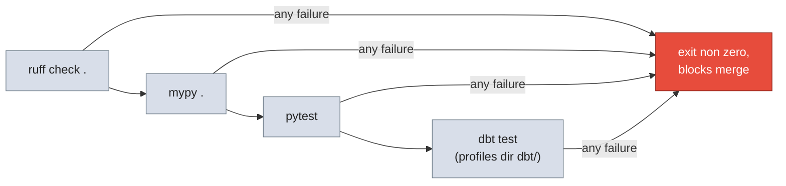

# Testing

What is tested, how to run it, and what the full quality gate covers.

## Test inventory

| Suite | Location | Covers |
|---|---|---|
| Unit tests | `tests/unit/` | window building, watermark coercion, job config, publish logic, engine config, logger, DAG wiring |
| GX suite tests | `tests/gx_tests/` | all demo suites pass, `--bad-demo` fails as expected |
| dbt tests | `dbt/models/*/_*.yml`, `dbt/tests/generic/` | data contracts on every silver and gold model |
| dbt snapshot | `dbt/snapshots/` | SCD2 history (validated through `dim_customers` tests) |
| GX gate | `gx/run_validations.py` | the live Postgres validation the DAGs run |

Unit test highlights:

- `test_pg_extract_incremental.py` / `test_mongo_extract_incremental.py`:
  `build_windows` edge cases (start greater than end, tied timestamps,
  fractional chunk days, full versus incremental bounds), `_coerce_datetime`
  variants, job config construction.
- `test_publish_gold_to_postgres.py`: default table coverage, write mode
  resolution, JDBC URL targeting, dry run and overwrite behavior, error
  handling.
- `test_dag.py`: the three DAGs parse, bronze tasks stay parallel, the
  compose file keeps its required services.
- `test_engine.py`: required variables raise, optional ones only warn,
  write mode defaults.

## Commands

```bash
# fast local loop
uv run pytest tests/unit tests/gx_tests -q
make test

# one file
uv run pytest tests/unit/test_pg_extract_incremental.py -q

# lint and types
uv run ruff check .
uv run ruff format --check .
uv run sqlfluff lint
uv run mypy src --ignore-missing-imports
make lint
make lint-fix   # auto fix
make fmt        # format only

# with coverage
make test-cov
uv run pytest --cov=src --cov-report=term-missing

# dbt tests (needs the Databricks warehouse from .env)
cd dbt && uv run dbt test --profiles-dir .

# the whole gate, same order CI uses
scripts/bash/run_all_tests.sh
make verify     # lint + test + GX demo, same as CI
make ci         # alias for verify
```

## run_all_tests.sh

The full gate, first failure stops the run, everything logged to
`logs/run_all_tests_<date>.log`:



`dbt test` inside the script uses the system dbt when available and falls
back to `uv run dbt`.

## CI

GitHub Actions is now wired up. Six workflows run on pull requests to `main`:

| Workflow | File | Trigger | What it does |
|---|---|---|---|
| CI | `.github/workflows/ci.yml` | PR and push to `main` | Full gate: ruff, format, sqlfluff, mypy, pytest, GX demo, dbt parse and docs, secrets scan |
| Lint | `.github/workflows/lint.yml` | PR touching `**.py` | `ruff check` and `ruff format --check` |
| Unit Tests | `.github/workflows/unit-tests.yml` | PR touching `src/` or `tests/` | `pytest` with coverage plus GX demo and DAG parse |
| SQL and Types | `.github/workflows/sql-and-types.yml` | PR touching `**.sql` or `dbt/` | `sqlfluff lint`, `dbt parse` and docs, `mypy` type check |
| Security | `.github/workflows/security.yml` | PR, push, weekly schedule | Secrets scan, dependency review, CodeQL |
| CI Full | `.github/workflows/ci-full.yml` | Manual or push to `main` touching `dbt/` | Full gate with real Databricks warehouse via `scripts/bash/run_all_tests.sh` |

Locally the same gates are available:

```bash
make verify   # lint + test + GX demo, same as CI
make ci       # alias for verify
make test-cov # pytest with coverage
```

The full gate `scripts/bash/run_all_tests.sh` remains the blocking check for warehouse backed `dbt test`. Run it before opening a pull request when dbt models changed.

## Testing conventions

- New PySpark logic needs a pytest covering at minimum the watermark
  filtering and the merge or write condition.
- New or changed dbt models need not null and unique tests on the primary
  key plus a relationships test on every foreign key.
- Never silence a failing test instead of fixing the root cause, and never
  lower a severity from error to warn to make a build pass.
- After any dbt model change, regenerate the docs (`dbt docs generate`)
  before committing so the lineage graph does not drift.
